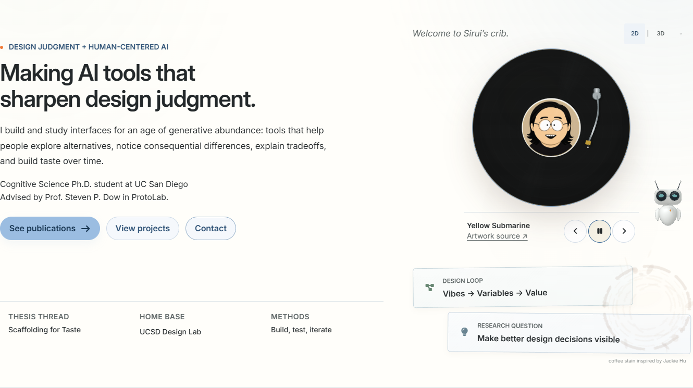
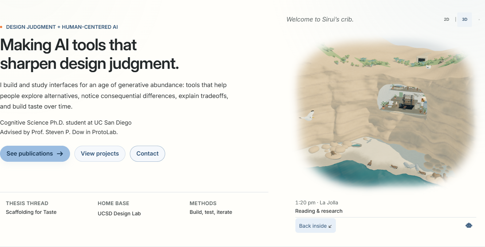
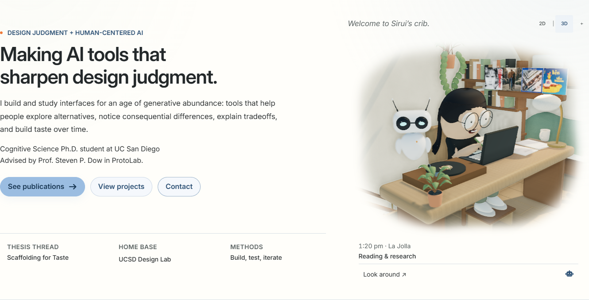

# Whole-site review and La Jolla scene iteration

October 1, 2026. This continues the [September reference study](design-study-2026-09-29.md) with a fresh rendered review of the current site and both collections supplied by Sirui. Read alongside the [design heuristics](../WEBSITE_DESIGN_HEURISTICS.md), [scene brief](homepage-desk-scene-brief.md), and [experiment backlog](design-experiment-backlog.md).

## Direction

Keep the research notebook inside an inhabited coastal home. The largest reading gains come from assigning consistent roles to titles, section headings, metadata, figures, and prose. The scene gains credibility when human proportions, object construction, contacts, motion, and light agree with one another.

The references offer useful relationships: an artifact beside its explanation, one recognizable object through a state change, and one light source shared by surfaces. Their full-screen staging, oversized typography, elaborate page turns, audio, and instrument panels do not automatically fit a personal research portfolio.

## Rendered coverage

The first audit captured the 29 routes in the public visual harness at 1440 and 390 pixels: 58 route/viewport states, with both first-viewport and full-page PNGs. These states returned HTTP 200 and had no horizontal overflow or browser runtime errors. This establishes a rendered baseline, not a usability-study result or proof of every interactive state.

The initial route set includes the homepage; writing index and pagination; two long-form notes; a year archive; projects index and fifteen project/case pages; publications and a paper context page; CV; news; AI profile; Build Rhythm; and the locked discovery route. The extended audit covers all ten published notes, seventeen local project pages, five publication context pages, and five announcements. Across the initial and extended sets, 54 distinct HTML routes/states received 108 desktop/phone captures, with 216 first-viewport/full-page PNGs and no HTTP, overflow, broken-image, or browser runtime failures.

The live sitemap contains 85 URLs. Of those, 52 received individual HTML captures; the audit also includes the 404 and locked-discovery states. The remaining sitemap entries are 31 repeated archive filters and two PDFs. Year, tag, and category archives were sampled through their shared layout; PDFs were outside this HTML audit. Unpublished drafts and the protected destination are outside public content inspection.

The retained baseline and route coverage report are under `.jekyll-cache/visual-qa/streams/site-review/` in this checkout. Physics comparisons are under `.jekyll-cache/visual-qa/streams/coastal-physics/`; model comparisons are under `.jekyll-cache/visual-qa/streams/coastal-models/` and the [committed model evidence](evidence/coastal-models-2026-10-01/README.md). The cache preserves detailed QA without publishing those files.

## Findings and implemented changes

| Area                         | Rendered finding                                                                                                                                                             | Implemented response                                                                                                           | Contract retained                                                                                                                                    |
| ---------------------------- | ---------------------------------------------------------------------------------------------------------------------------------------------------------------------------- | ------------------------------------------------------------------------------------------------------------------------------ | ---------------------------------------------------------------------------------------------------------------------------------------------------- |
| Homepage                     | The research introduction and selected-work structure already read clearly. The portrait/disc caption and transport are beneath the object as intended.                      | Improve the existing vinyl mechanism and intentional 3D view within their current footprint.                                   | Approved signature copy, default 2D view, shared selection state, stationary reachable controls, no audio claims.                                    |
| Writing index                | Several list-entry headings are as large as the page title, making the index harder to scan.                                                                                 | Give list titles their own smaller role and retain readable descriptions and metadata.                                         | Authored titles, reading links, pinned note, discovery behavior.                                                                                     |
| Projects index               | Large title roles and technical origin metadata compete with the actual project question.                                                                                    | Establish a calmer card hierarchy and quieter origin credit.                                                                   | In-place expansion, focus return, complete original scientific figures and credit.                                                                   |
| Publications                 | The opening wall, badges, XP, controls, and filters delay the paper list on a phone.                                                                                         | Compact the opening while keeping the personal wall and XP visible and usable.                                                 | Accepted papers remain primary; rejection receipts and exact event-based XP retain their meaning.                                                    |
| CV                           | Section headings inherit a large display role.                                                                                                                               | Use the established section-heading size and a consistent hierarchy.                                                           | Content, PDF access, section navigation, readable date/location metadata.                                                                            |
| Trace-paper case             | Broad painted enclosures and very wide abstract lines weaken the reading rhythm.                                                                                             | Use a comfortable reading measure, meaningful artifact adjacency, and shared Sass rather than isolated page styling.           | Workshop/position-paper status, authors, exact research claims, complete credited figure.                                                            |
| Other case pages             | Most already pair a narrow reading column with real evidence.                                                                                                                | Keep that successful structure; verify shared-style regressions.                                                               | Actual process and evidence rather than invented case-study history.                                                                                 |
| P companion                  | Its painted canvas extends beyond the compact collision footprint. On mobile it touches a heading and a standalone trace caption.                                            | Protect headings and all caption forms using the complete painted bounds.                                                      | A small optional companion with clear pause behavior; reading and links stay usable.                                                                 |
| AI, archive, and news routes | Utility tables, concise lists, and source links suit these routes. Five announcement detail pages expose generated titles.                                                   | Add an archive return link and descriptive announcement headlines grounded in their existing bodies; verify shared typography. | Semantic/source-readable AI content, clear chronology, original announcement bodies, and dates.                                                      |
| Coastal room                 | Existing water, reflections, contact shadows, original geometry, and activity routines are substantial foundations. The figure and some props still read as simplified toys. | Refine adult anatomy, swept-back hair, hands, physical object construction, coastal geology, contact, and material response.   | Five identities, glasses/clean-shaven Sirui, camera grids, connected mainland/cave/beach/Pacific, capybara print, fallback and suspension contracts. |

These are judgments from rendered inspection. Whether visitors understand the research faster remains unmeasured; visual comparison and interaction checks test the implementation, not that broader claim.

## Reference lessons

The [100 HTML collection](https://miaai-lab.github.io/Claude-Opus-5.5-100-HTML-Files/) was screened at catalogue level, with a focused rendered sample. The current [Feishu collection](https://zcnofdpgpxud.feishuapp.com/app/app_17exzr8eka4/) presents 118 examples, including 15 video and 103 web entries. This updates the older 22-entry source-index observation; it is not a claim that all 218 examples received an interaction audit.

| Visually inspected reference                                                                                           | What was exercised or observed                                                                      | Transfer to this site                                                                                   |
| ---------------------------------------------------------------------------------------------------------------------- | --------------------------------------------------------------------------------------------------- | ------------------------------------------------------------------------------------------------------- |
| [008 — The Last Keepers](https://miaai-lab.github.io/Claude-Opus-5.5-100-HTML-Files/008-lighthouse-longform.html)      | Reading entry, long-form text, margin notes, and the relationship between scene and article.        | Preserve a comfortable text measure and keep notes near the evidence they explain.                      |
| [087 — Sketchbook Portfolio](https://miaai-lab.github.io/Claude-Opus-5.5-100-HTML-Files/087-sketchbook-portfolio.html) | Process navigation and the resulting artifact/checklist spreads.                                    | Show real iteration beside the finished work, without requiring a page-turn performance to read it.     |
| [057 — Vinyl Listening Room](https://miaai-lab.github.io/Claude-Opus-5.5-100-HTML-Files/057-vinyl-listening-room.html) | Disc, grooves, stationary lighting, platter, S-shaped arm/pivot/counterweight, and fixed transport. | Plausible mechanism and shared material/light relationships within the existing small record.           |
| [V07 — UI Morph](https://zcnofdpgpxud.feishuapp.com/app/app_17exzr8eka4/#v07-ui-morph)                                 | Paused and scrubbed the timeline from button to music-player state.                                 | An interruptible transition starts from the object's current state and keeps its identity recognizable. |
| [W05 — Escapement](https://zcnofdpgpxud.feishuapp.com/app/app_17exzr8eka4/#w05-escapement)                             | Mechanism, explanatory annotations, and exploded arrangement.                                       | Parts and labels should explain actual relationships, with coherent light and material response.        |
| [093 — Windwalker](https://miaai-lab.github.io/Claude-Opus-5.5-100-HTML-Files/093-strandbeest-walker.html)             | Moving leg linkages, paths, planted endpoints, and ground shadows.                                  | Contacts and constrained movement matter more than adding unrelated motion.                             |
| [096 — MONOLITH](https://miaai-lab.github.io/Claude-Opus-5.5-100-HTML-Files/096-concrete-monolith.html)                | Architectural axonometric drawing, shared sun control, and live material library.                   | Plausible surface scale, board/joint construction, and a common lighting direction.                     |
| [100 — Organic Wave Lab](https://miaai-lab.github.io/Claude-Opus-5.5-100-HTML-Files/100-organic-wave-lab.html)         | Double-slit and parabolic-reflection states with a changing field, highlights, and linked probe.    | A coherent wave field and normals; its neon laboratory presentation is specific to that demonstration.  |

V07 credits [@zero / twoclipping through YouMind](https://youmind.com/video-prompts/ui-morphing-motion-template-11361). The generated demo and its attributed source remain distinct. No reference code, images, audio, textures, or models are copied into the site; these comparisons inform original implementation.

## Physical-method standard

Sirui requested research-grade physical quality. A useful implementation must name the actual method, expose its assumptions, test relevant invariants, and show a visible result with a bounded browser cost. Existing analytic waves, reflection passes, and contact shadows should not be relabeled as new work.

Primary research screened includes [XPBD](https://mmacklin.com/xpbd.pdf), [Heitz's masking-shadowing analysis](https://jcgt.org/published/0003/02/03/paper.pdf), [Hillaire's real-time atmosphere](https://sebh.github.io/publications/egsr2020.pdf), the [2024 SIGGRAPH rolling-wave talk](https://www.siggraph.org/wp-content/uploads/2024/09/talks.html), and [ArcBlanc's ocean framework](https://arxiv.org/abs/2503.03326). The bounded ocean implementation draws on [Bruneton, Neyret, and Holzschuch's multiscale ocean-lighting method](https://evasion.inrialpes.fr/Publications/2010/BNH10/); solar direction uses [NOAA's approximate solar-position equations](https://gml.noaa.gov/grad/solcalc/solareqns.PDF). Screening does not mean implementing every paper. XPBD is a 2016 MiG method; Heitz's paper is JCGT 2014; Hillaire's is EGSR 2020; the multiscale ocean paper is Computer Graphics Forum 2010. Calling any subset a complete current state-of-the-art or a validated SIGGRAPH contribution would exceed the evidence.

### Implemented relationships

The Pacific uses ten deterministic gravity/capillary wave bands in meters and seconds. Each band's angular frequency is `sqrt(g k + (surface_tension / density) k^3)`. The same parameters generate the CPU reference sampler and the GLSL displacement field. Exact displacement tangents supply the normal and horizontal compression Jacobian. Finite-difference checks compare the analytic derivatives with the displaced surface, and a steepness bound checks that the authored field remains free of foldover.

The vertex stage filters short waves out of the coarse geometry. At pixel scale, a Gaussian footprint filter transfers unresolved slope variance into the material's roughness using `r_eff = (r^4 + variance)^(1/4)`. This is a scalar isotropic fit inspired by the multiscale ocean paper; it does not implement that paper's full anisotropic covariance/BRDF. Foam uses wave compression and the existing authored shoreline profile. Depth color remains an approximation.

The existing 384 × 384 planar reflection now retains linear radiance, uses exact unpolarized dielectric Fresnel at water IOR 1.333, and replaces indirect specular while preserving the other lighting terms. A five-tap footprint softens the reflection. The wave grid grows from 120 × 120 to 160 × 160 subdivisions, with vertices concentrated near the inhabited coast: 22,400 additional triangles, the same water draw and reflection pass count, and four additional reflection samples per shaded pixel.

NOAA's approximate solar equations use the authored La Jolla coordinates and Pacific time. The directional light, shadows, visible sky sun, and reflection environment share that direction. The environment-map capture updates in twenty-minute buckets. Night uses an authored weak moon key. This represents a situated miniature rather than surveyed architecture or a live weather reconstruction; the noon-derived UTC offset also approximates the hours around a daylight-saving transition.

The record motor integrates angular position and exponential speed response exactly, with a target of 33⅓ RPM. Two critically damped coordinates drive the tonearm's lift and swing; the cue sequence raises, swings, then lowers, with a unilateral lower bound at disc contact. Rapid input keeps the current position and velocity. The SVG/CSS fallback uses the same small integrator independently of Three.js, and reduced motion composes a still pose. The visual disc has no audio playback or track-progress semantics.

The model pass retains editable Blender sources, original geometry, the named rigs, and existing activity anchors. Adult proportions, separated fingers, tapered necks, ear-tucked long hair, hollow ceramics, open chair/footrest frames, a recessed sink, rounded construction, and wave-worn sandstone are evaluated in actual source renders and browser rooms. Authored poses and residual contact correction remain bounded animation techniques; their acceptance checks do not establish unrestricted whole-body dynamics.

The implementation has no FFT ocean, Navier–Stokes or breaking-fluid solver, foam advection, full atmosphere transport model, or solid/fluid coupling. These limits define what the supplied research does and does not substantiate. Frame-cost measurements, contact checks, model provenance, and integrated before/after evidence are recorded with the checkpoint below.

## Integration checkpoint

All three streams are integrated on `main`. A final October 1 fetch confirmed `origin/main` at `0bf38b1da92fbe9d5fe5909d47dc3a1f120413e6`, with no remote commits missing locally. The combined implementation is at `68e481eba`: reading changes from `8ae09ae64` and `b1aea7e38`, physical rendering and record mechanics from `7c241e110`, and authored models from `ae9834dd5`. The final coordinator checkpoint records the evidence, corrected Docker checks, and reviewed override hashes. These are local commits; this iteration does not publish a deployment.

| Evidence                  | Integrated result                                                                                                                                                                                                                                                                                                                                                                                                                   |
| ------------------------- | ----------------------------------------------------------------------------------------------------------------------------------------------------------------------------------------------------------------------------------------------------------------------------------------------------------------------------------------------------------------------------------------------------------------------------------- |
| Production build          | Docker Jekyll build with `/al-folio` passed; the live preview separately serves an empty baseurl at `http://localhost:8080/`.                                                                                                                                                                                                                                                                                                       |
| Static and logic checks   | 166 Python tests, 31 Node motion/camera/navigation/companion checks, the style contract, and whitespace checks passed.                                                                                                                                                                                                                                                                                                              |
| Sitewide checkpoint       | Home, publications, and the trace-paper case passed 12 route/viewport tests covering 24 light/dark states at 1440 × 1000, 1280 × 800, 768 × 1024, and 390 × 1000. The independent reading stream also passed its ten-route checkpoint.                                                                                                                                                                                              |
| Combined 3D composition   | Eight light/dark scene cases passed across the same four viewports, with nonblank pixels, connected rooms, visible orbit/zoom changes, keyboard focus, and an outside/inside return path.                                                                                                                                                                                                                                           |
| Combined motion and state | Eleven accepted desktop/phone cases cover stationary 44-pixel transport controls, continuous pause/resume, raised-arm artwork transfer, newest-record selection, unavailable graphics, reduced-motion SVG, changing water pixels, La Jolla light, all five avatars sharing one actor/art/album state, hidden/offscreen recovery, touch transport, and pinch/Now recovery. Two desktop touch-only cases were intentionally excluded. |
| Second browser engine     | Five iPhone/WebKit checks passed for keyboard playback/discovery, the inspectable record fan, publication context/abstract access, and native why-cite disclosures.                                                                                                                                                                                                                                                                 |
| Asset identity            | Nine representative served modules, manifest, room/coast GLBs, and avatar GLBs matched their current source SHA-256 values before the combined checkpoint.                                                                                                                                                                                                                                                                          |
| Override review           | Exactly five changed plugin-owned shadows were re-acknowledged: archive layout, blog/components/publications Sass, and the main Sass entry. The other 75 entries retain their prior acknowledgement state.                                                                                                                                                                                                                          |
| Formatting                | All changed supported text paths passed targeted Prettier. The whole-repository command still exits with existing warnings: 341 current warnings versus 363 at the initial baseline, with no new warning paths. Unrelated files were not reformatted.                                                                                                                                                                               |
| Freshness                 | The October 1 Scholar refresh records 275 lifetime citations; the paired citation/lens snapshot was reviewed and committed together. Curated annual evidence retains its actual earlier capture date.                                                                                                                                                                                                                               |

Two initial integration failures concerned the harness: legacy publication tests hardcoded `/al-folio` against the root-site preview, and the transport-position test took its baseline before the header's post-load height measurement moved the whole page by four pixels. The tests now use the configured public route helper and wait for header initialization. The corrected states pass; their earlier logs and layout diagnostic remain in the ignored evidence cache.

The final combined water capture changed 63.0% of the sampled sea-region pixels over 500 milliseconds. This demonstrates visible motion in the actual water region, rather than a telemetry-only update. It is not a physical validation metric. The independent real-clock runtime sample on an RTX 3080 Ti using Chromium/ANGLE D3D11 measured daytime frame intervals of 16.7 ms median and 16.8 ms p95; evening reached 33.3 ms p95. Those timings precede model integration and are a local hardware observation, without GPU timestamps or a real-handset guarantee. The [method note](../assets/js/home-scene/PHYSICS.md) records the measured rendering costs and mathematical checks.

All sixteen delivered GLBs total 7,070,400 bytes, an increase of 13,552 bytes (0.192%). The initial selection is 3,574,833 computed gzip-equivalent geometry bytes, below the 4 MiB geometry budget; this is not the full page payload or measured HTTP transfer size. The [model checkpoint](evidence/coastal-models-2026-10-01/README.md) records source and live contacts, editable sources, triangle counts, silhouettes, objects, sleep fit, and the geology references. The final live sampled grip error stayed below three micrometers; authored endpoints and sampled phases do not establish a general dynamics solver.

### Actual integrated homepage views

These full-hero Chromium captures use the combined Docker site at 1440 × 1000, October 1 at 1:20 pm Pacific, a noon page theme, and reduced motion. The public views exercise ordinary public controls. The closer study view uses the existing authoring controls and labels its time as a preview; its visible style experiments remain outside the public interface. [State evidence](evidence/coastal-integration-2026-10-01/evidence.json) records the rooms, identities, camera, light, water, record state, and absence of runtime/overflow/image failures.

| Public 2D vinyl                                                                                                      | Public connected coast                                                                                                           |
| -------------------------------------------------------------------------------------------------------------------- | -------------------------------------------------------------------------------------------------------------------------------- |
|  |  |

Detailed accepted evidence is retained under `.jekyll-cache/visual-qa/checkpoint/`, `integrated-scene-layout/`, `integrated-scene-runtime/`, `integrated-record-stability/`, and `integrated-webkit-correct-routes/`. A full release-scale visual matrix was not run for this local iteration. The three worker containers were stopped, their merged temporary branches removed, and their ignored comparisons and portable Blender runtime preserved in this checkout. The app rejected a worktree archive because a pinned task protects it; the temporary checkouts remain clean at detached verified commits. The owned Docker preview remains running on port 8080.
