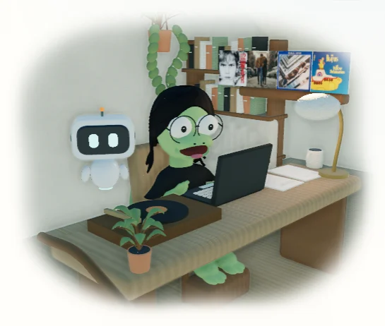
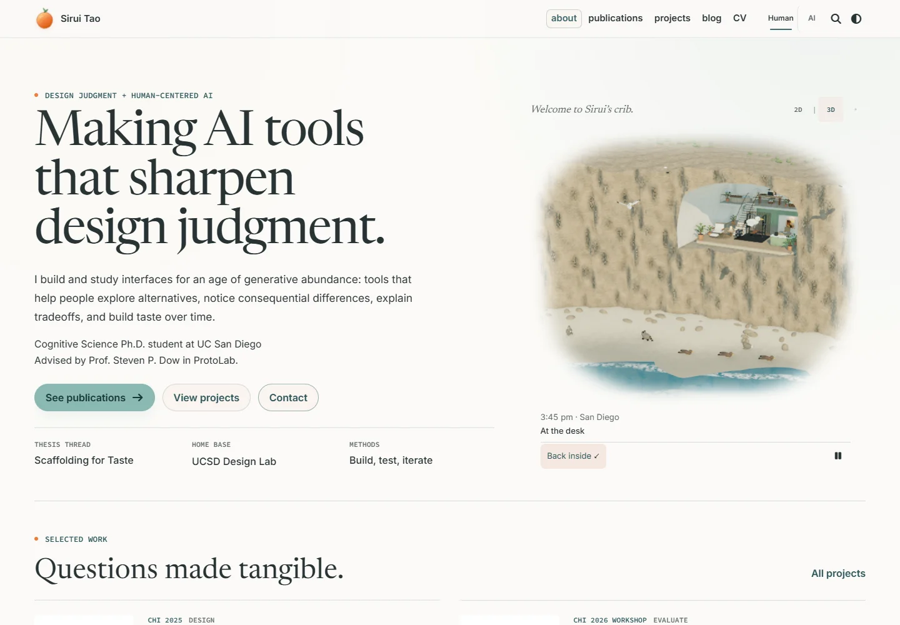

# Pip and a livelier coastal home

September 13, 2026, following the review of `5cd5432fc`. Implemented locally on `main`.

[Local preview](http://localhost:8080/?cinematic=live) · [Motion recording](pip-introduction.webm) · [Behavior and copy](../../homepage-desk-scene-brief.md#pip-the-studio-companion) · [Asset provenance](../../../artwork/coastal-home/PROVENANCE.md)

## One companion, two places

Pip starts beside the album. Its head acknowledges the pointer while its body follows more slowly, with damped motion. It sometimes wanders, ignores the pointer, offers a short remark, or nudges a card before restoring it. Clicking its head gives a greeting; hover or keyboard focus reveals its nap control. Reduced motion uses a still pose. Navigation retains the nap preference and arrival position.

[Before](home-before.webp) · [After](hero-after.webp): the same 1440 × 1000 viewport's hero region. The greeting is now “Welcome to Sirui’s crib.” Both are composed light views; their time-theme accents differ.

| Morning                      | Noon                   | Afternoon                        | Evening                      |
| ---------------------------- | ---------------------- | -------------------------------- | ---------------------------- |
|  |  |  |  |

The page uses a small analytic WebGL robot with ceramic surfaces, glass reflections, colored eyes, rim light and a hover shadow. It loads neither Three.js nor the house models in 2D. A CSS face handles graphics failure and context loss. The room counterpart is articulated Three.js geometry with physical materials and actual shadows. One owner transfers Pip between the room and the reading page. Authored perches and circulation paths constrain its trips to the beach and back.

Ordinary remarks wait roughly 45–80 seconds between attempts and last 3.5 seconds. They respond to projects, research, publications, the blog, CV and contact. Clearance checks protect prose, figures, links and controls. Nudges preserve words, destinations and document flow. Semantic AI routes remain undecorated.

[Desktop blog](blog-research-skills-desktop-1440.webp) · [Mobile blog](blog-research-skills-mobile-390.webp) · [Desktop case study](project-designweaver-desktop-1440.webp) · [Mobile case study](project-designweaver-mobile-390.webp)

## Plants and coastal neighbours

The study has a hanging planter with trailing leaves, a bracket and suspension cords. Larger floor plants furnish the kitchen and lounge. They are editable Blender geometry, exported with their rooms. Leaf materials add small wind movement and backlighting.

[Kitchen](breakfast.webp) · [Gym](workout.webp) · [Ocean-facing onsen](soak.webp) · [Lounge](lounge.webp) · [Sleeping alcove](sleep.webp)

Beach base depth increases from 6.6 to 14 meters, with a larger cove bulge. Blender terrain, surf and animal contacts share shoreline parameters. Wet and dry sand blend by elevation and roughness. Broken foam crests replace parallel white stripes. The atmosphere contains 140 spray particles, 42 study dust motes and 18 onsen vapor particles.

Two brush rabbits, a raccoon, four flying gulls, one balcony gull and three sandpipers have original geometric bodies and bounded motion. No scenic image or animal cutout was introduced.

[Night exterior](outside.webp) · [Previous shore](../coastal-section/exterior-day.webp). The previous capture uses a different camera and is historical evidence, not an identical-pixel comparison.

The garden and shore were rebuilt with Blender 4.5.9's background Python API. Native Blender mouse/keyboard control is unavailable in this session. Pip and the wildlife are authored browser geometry. Particle fields, paths and damped motion are procedural effects, not a general rigid-body or fluid simulation.

## Responsive evidence

| Viewport    | Light                                   | Dark                                   |
| ----------- | --------------------------------------- | -------------------------------------- |
| 1440 × 1000 | [Capture](home-light-desktop-1440.webp) | [Capture](home-dark-desktop-1440.webp) |
| 1280 × 800  | [Capture](home-light-laptop-1280.webp)  | [Capture](home-dark-laptop-1280.webp)  |
| 768 × 1024  | [Capture](home-light-tablet-768.webp)   | [Capture](home-dark-tablet-768.webp)   |
| 390 × 1000  | [Capture](home-light-mobile-390.webp)   | [Capture](home-dark-mobile-390.webp)   |

The recording includes the initial 3D loading interval, pointer response, a card nudge, scrolling away from and back to the room, and the exterior. Room captures, lighting samples, reading pages and recording frames were inspected directly.

## Measurements and checks

[Exact resources, timings and GPU identity](performance.json). Serial Chromium ran on this Windows computer's RTX 3080 Ti without CPU or network throttling. Mobile is viewport/touch/DPR emulation on the same GPU, not a physical phone benchmark.

| Measurement                           |     Desktop | Emulated mobile |
| ------------------------------------- | ----------: | --------------: |
| 2D companion frames/s                 |        60.0 |            60.0 |
| Study frames/s                        |        60.0 |            60.1 |
| Gym / exterior frames/s               | 60.0 / 60.0 |     60.0 / 60.0 |
| Study frame interval, 95th percentile |     16.8 ms |         16.8 ms |
| First 3D frame in this sequence       |     3985 ms |          908 ms |

The desktop run precedes the warmer-cache mobile run; loading times are not a device-speed comparison. Conservative initial size is **2.30 MB gzip / 3.61 MB uncompressed**, including the largest room and avatar. Page companion scripts add **9696 bytes gzip**. Local HTTP serves the modules uncompressed; estimates and transfers are recorded separately. Blender sources and evidence media are excluded from production.

- Scene and companion matrix: **67 passed, 9 intentional skips**, across four viewport projects. Includes visible WebGL, orbit/zoom pixel changes, avatar/album state, previews/Now, touch, pause, hidden-tab recovery, loading failures and Pip's handoff/repair behavior.
- Final companion smoke: **6 passed**, including WebGL context loss and restoration.
- Scoped sitewide checkpoint: **60 passed, 42 intentional skips**. Two full-catalog tests initially rejected the narrowed fixture before visiting a page. Rerun with the full catalog, the high-DPR and 200% text checks both **passed**.
- **163 Python tests**, **13 Node tests**, Black and style-contract checks passed. Changed-file Prettier and `git diff --check` passed. Full-repository Prettier reports 343 existing files; none of its warnings is in a changed file.
- Production Jekyll build uses `/al-folio`; generated scripts, styles, models and authoring exclusions are checked. The override audit completes, retaining the existing 80 local overrides and reviewing the two changed acknowledgements.
- Final room review and performance runs recorded no browser runtime errors.

The five Sirui models are retained from the preceding likeness pass. These are stylized miniatures with authored motion, not unrestricted scene collision or production character deformation. On crowded pages Pip can wait out of view until a safe gap appears.

Full PNGs and logs remain under `.jekyll-cache/visual-qa/companion/`. Reproduction commands are in the [implementation handoff](../../research-studio-implementation.md#evidence-and-reproduction); `node bin/measure_coastal_home.cjs` includes Pip and its module payload.
