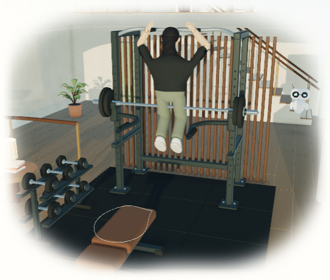
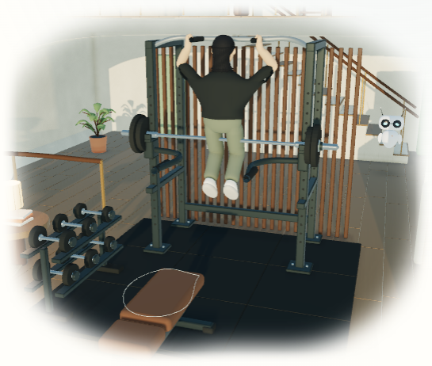
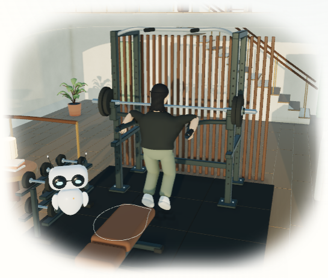
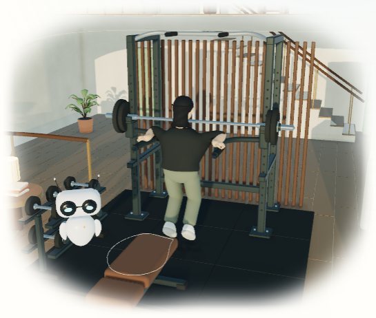
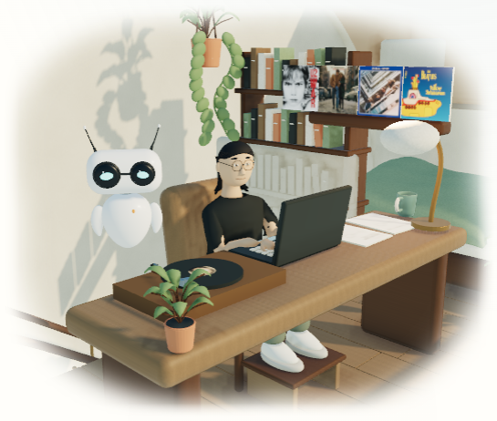
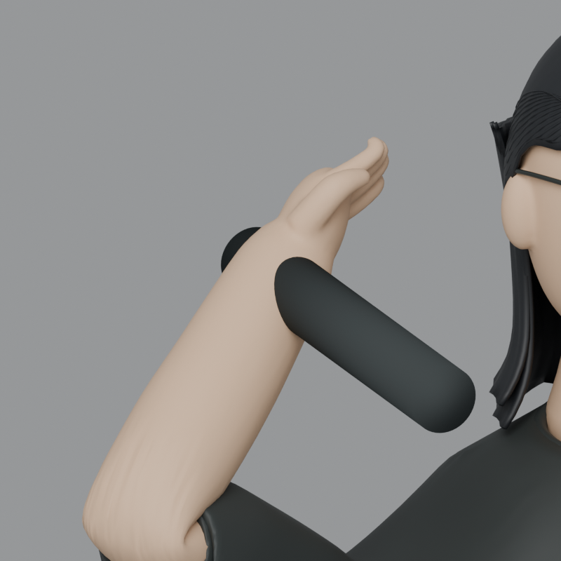
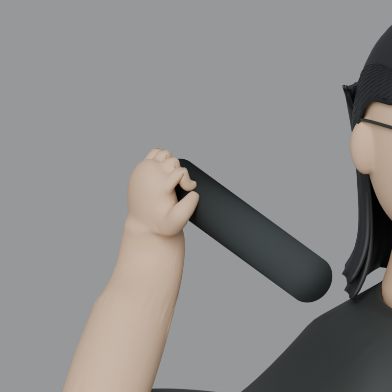
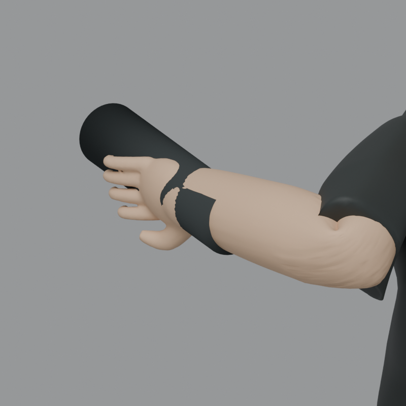
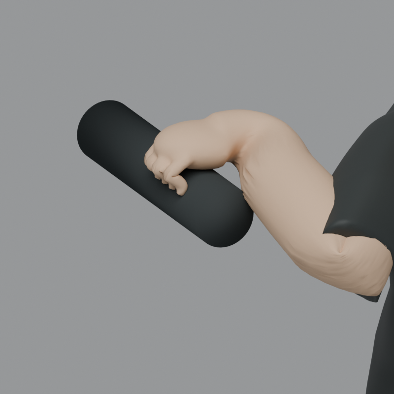

# Ghibli gym grip refinement — October 1, 2026

The original Ghibli hands stayed open above the pull-up handles, and the handle passed through the wrist skin. The delivered source uses the existing anatomical wrists, fitted equipment offsets and twenty native finger joints. Pull-up and dip fingers now curl around the original rubber cylinders. Sirui's face, hair, clothing, rest mesh and materials are preserved; the other fifteen GLBs are byte-identical to `0f948c5ba`.

These are original Blender and actual browser renders. No generated image, imported geometry or photographic texture is substituted for implementation. The grips are authored poses with limited skin compression, rather than a hand dynamics solver or a photoreal likeness.

| Actual homepage frame | Before                                                    | After                                            |
| --------------------- | --------------------------------------------------------- | ------------------------------------------------ |
| Pull-up               |  |  |
| Dip                   |              |        |

The browser pairs use the same current lighting, camera, viewport and runtime. The before run serves only the original committed Ghibli GLB and removes the Ghibli wrist offsets from the served manifest. All other assets remain present. Both runs show active strength phases; their body positions can differ slightly because animation advances during browser capture. [Browser evidence](browser-evidence.json) records the exact frames and modes. The delivered browser run has no page errors, one actor and fourteen clips. Pull-up/dip wrist target errors were 0.18 and 1.10 micrometers in the captured frames. Study, soak and sleep retain their existing equipment targets.



The [front](../../../artwork/coastal-home/portraits/ghibli-front.png), [profile](../../../artwork/coastal-home/portraits/ghibli-profile.png) and [body](../../../artwork/coastal-home/portraits/ghibli-body.png) studies remain unchanged. The new matched native Cycles studies use the actual handle radii and axial extents, with identical cameras, materials and 48-sample lighting:

| Native contact study | Before                                                                                                      | After                                                                                                  |
| -------------------- | ----------------------------------------------------------------------------------------------------------- | ------------------------------------------------------------------------------------------------------ |
| Pull-up hand         |  |  |
| Dip hand             |         |         |

`coastal_hands.py` adds twenty deform joints to Ghibli's original eighteen-joint rig, and preserves all fourteen clips. Native grip arms/fingers are baked every frame. A first prototype retained the old wrist-at-cylinder-center convention by translating the wrist skin; its flared outline was rejected. The delivered correction instead places the actual wrist beside the handle before solving the arm. Root's runtime adapter consumes the same manifest offsets for Ghibli's two grip clips. Other clips and avatars retain their original targets.

Offsets are exported Three Y-up actor-local meters, ordered left/right. Blender `(x, y, z)` becomes `(x, z, -y)`; the runtime rotates offsets by actor yaw before solving.

```json
{
  "pullup": [
    [-0.05, -0.055, 0],
    [0.05, -0.055, 0]
  ],
  "dip": [
    [0.055, 0.058, 0],
    [-0.055, 0.058, 0]
  ]
}
```

The original rest vertices, polygon connectivity and material assignments have the same hash. Across all twelve non-grip clips at five times each, the greatest deformed vertex difference is 0.36 micrometers. This includes typing, cup carry/preparation, reading, sleep and soak. [The contact report](../../../artwork/coastal-home/reviews/hand-contacts.json) contains 132 left/right hand samples over both grip clips, including 128 actual half-frame interpolation samples between the delivered per-frame keys. Every digit has at least thirteen source vertices within 2 millimeters of the finite cylinder surface; none of the sampled hand vertices is more than 3 millimeters inside it. Maximum native interpolated wrist target error is 0.33 millimeters. Deepest sampled skin intersection decreases from 23.88 to 2.05 millimeters for pull-ups, and 33.76 to 2.09 millimeters for dips. These signed vertex samples are separate from bone target accuracy and do not prove continuous triangle collision clearance. The native interpolation error also differs from the browser's final IK correction measured above.

[Measured asset results](measurements.json): Ghibli remains 166,110 triangles. Its GLB grows from 633,788 to 816,236 bytes for the finger skin weights, joints and native animation; all sixteen GLBs total 7,259,564 bytes, up 182,448 bytes. Complete selected Ghibli geometry is 3,776,633 computed gzip-equivalent bytes versus 3,744,542 previously, an increase of 32,091 bytes. This is computed GLB compression, not measured HTTP compression or the full page payload. The existing first-scene budget check, which includes the engine, local decoder, artwork and largest room/actor, passes.

Validation passed: the 132-sample source surface review, sixty non-grip pose comparisons, all-five source foot/bed/equipment checks, both active browser grip phases, direct browser study/soak/sleep checks, 166 Python tests with the coordinator's shared-rig assertion update, the style contract, targeted formatting and Python compilation. The first browser capture harness incorrectly paused the strength sequence before sampling; it stopped at its phase assertion. The corrected capture samples active phases. This is a focused contact checkpoint; root owns the current production build, combined responsive/light/dark release checks and runtime commit.

Reconstruction uses Blender 4.5.9 LTS. Preserve the pre-change source from `0f948c5ba` in an ignored baseline path before rebuilding, then run:

```powershell
& $blender -b --python-exit-code 1 --python bin/build_coastal_home.py -- --avatar=ghibli
# Focused source update instead of rebuilding the character:
# & $blender -b --python-exit-code 1 --python bin/refresh_coastal_grips.py
# After fitting changes on an already articulated source, add -- --repose.
& $blender -b --python-exit-code 1 --python bin/review_coastal_grips.py -- --baseline=.jekyll-cache/hand-before.blend
& $blender -b --python-exit-code 1 --python bin/render_coastal_grips.py -- --baseline=.jekyll-cache/hand-before.blend
& $blender -b --python-exit-code 1 --python bin/review_coastal_models.py
npx.cmd prettier assets/models/home/manifest.json artwork/coastal-home/reviews/hand-contacts.json artwork/coastal-home/reviews/model-contacts.json --write
node.exe bin/capture_coastal_grips.cjs before --base-url=http://127.0.0.1:8080
node.exe bin/capture_coastal_grips.cjs after --base-url=http://127.0.0.1:8080
```

`coastal_section.py`, the full Ghibli builder and focused exporter all call the same manifest helper. It updates only Ghibli's offsets, preserving camera grids, terrain, room/contact anchors, other avatar fields and capybara artwork. Actual browser acceptance requires root's coupled wrist-target adapter and the physical lighting dependency; an asset-only integration would move the anatomical wrist back into the cylinder center.

The browser helper also accepts `--baseline-ref=<commit>` and `--output=<directory>`; `COASTAL_BASE_URL` supplies the URL when no explicit option is given. The retained browser evidence was captured on the owned worker server at port 8083. Cycles uses CUDA when available and falls back to CPU on other platforms.
