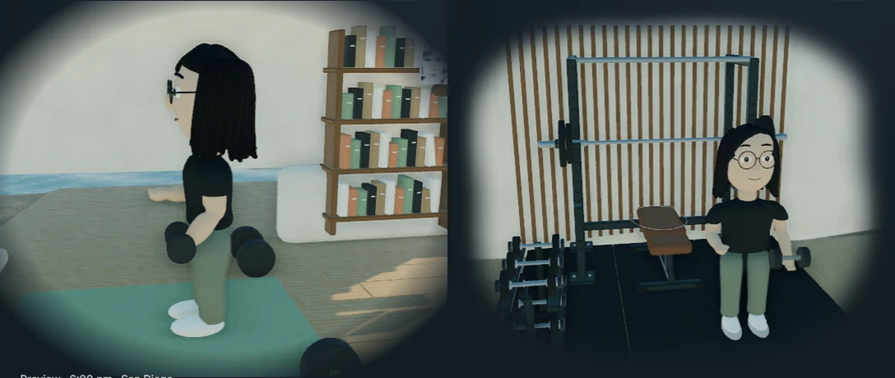
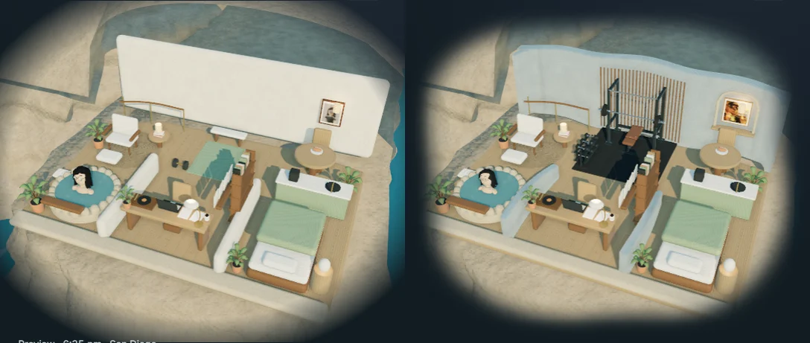
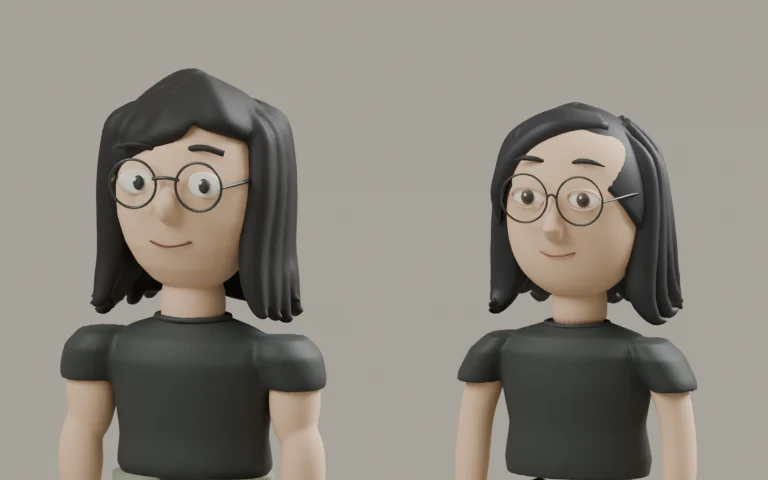

# Carved rooms, a proper gym, and revised human models

September 13, 2026, following Sirui's review of `788508a82`. Integrated locally on `main`. These are captures of implemented geometry and the website; the earlier generated character board remains a visual reference, not evidence of the finished models.

[Local preview](http://localhost:8080/?cinematic=live) · [Scene brief](../../homepage-desk-scene-brief.md) · [Blender sources and provenance](../../../artwork/coastal-home/PROVENANCE.md)

## The gym and room boundaries

The gym now has a four-post power rack with pull-up bar, safeties and J-cups, a loaded barbell with collars, a padded bench, a two-tier dumbbell stand, and rubber flooring. Sirui stands beside the bench in a clear workout area. The camera shows his activity and the equipment together without the study bookshelf blocking them.

The cave's back wall follows shallow scalloped recesses, with rounded returns and curved low divisions. Oak battens line the gym; the capybara print sits in a light oak frame in an arched kitchen niche. The same image stays on the wall through avatar and mode changes. The cliff, ocean, beach and mountain remain modeled geometry.

[Kitchen and capybara comparison](compare-breakfast.webp) · [Study comparison](compare-work.webp) · [Onsen comparison](compare-soak.webp)

Room comparisons include the deliberate camera/framing changes. The character studies below use the same Blender camera before and after.

## Four rebuilt human variants

The human models have shaped jaw and forehead profiles, inset eyes, revised noses and smiles, an off-centre hair part with tapered locks, sloping sleeves, individual fingers, tapered trousers and laced canvas shoes. Their original ten clips and shared bone convention remain. Lizard's geometry is retained in this pass.

| Human interpretation | Comparable Blender study                        | In the gym                         |
| -------------------- | ----------------------------------------------- | ---------------------------------- |
| South Park           | [Before / after](character-south-park.webp)     | [Capture](gym-south-park.webp)     |
| Simpsons             | [Before / after](character-simpsons.webp)       | [Capture](gym-simpsons.webp)       |
| Ghibli               | [Before / after](character-ghibli.webp)         | [Capture](gym-ghibli.webp)         |
| Rick and Morty       | [Before / after](character-rick-and-morty.webp) | [Capture](gym-rick-and-morty.webp) |

[Live human motion: workout, study and onsen](live-human.webm). This records the rendered canvas; page screenshots below show its composited edge. The models remain stylized interpretations whose likeness is judged against Sirui's portrait and [supplied character board](../../../artwork/coastal-home/reference-character-study.png).

Actual asset creation used Blender 4.5.9 LTS through its Python API. Native Blender mouse/keyboard control was unavailable. `coastal_characters.py` and `coastal_interiors.py` are editable authoring helpers; their output is geometry and rigs. The model-review portraits now live under `artwork/`, excluded from the production build.

## Organic edge and responsive behavior

The old oversized radial fade still had visible opacity at the canvas boundary. An asymmetric vector alpha silhouette now fades completely inside all four sides, in either theme. The mobile canvas also stops inheriting the old 28.2rem minimum height, which exceeded its container and stretched the picture. The clock has its own space below the scene. Keyboard focus uses a visible contour inside the mask.

These public-page captures use a fixed September 11, 17:45 Pacific clock to show the gym consistently. The page themes remain independently selected. Public controls stay at 2D/3D, Look around / Back inside, and motion pause; the authoring selectors are absent.

| Viewport    | Light page                      | Dark page                          |
| ----------- | ------------------------------- | ---------------------------------- |
| 1440 × 1000 | [Capture](scene-noon-1440.webp) | [Capture](scene-evening-1440.webp) |
| 1280 × 800  | [Capture](scene-noon-1280.webp) | [Capture](scene-evening-1280.webp) |
| 768 × 1024  | [Capture](scene-noon-768.webp)  | [Capture](scene-evening-768.webp)  |
| 390 × 1000  | [Capture](scene-noon-390.webp)  | [Capture](scene-evening-390.webp)  |

The initial mode remains 2D on every viewport, with explicit session choices retained. Avatar selection remains random on refresh and independent of the album.

## Verification and measured cost

- Scene coverage: 46 passing cases across four viewport projects, with six intentional device-specific skips. The initial run had one pause-test timing failure caused by a newly streamed room requesting a still redraw. Waiting for room loading before measuring idle frame counts resolved it; the recovery test passed at all four sizes and three additional mobile repetitions.
- Nonblank WebGL, actual orbit/zoom pixel changes, all five avatars, composed activities and contacts, shared capybara art, album focus/swap/drop/return, touch pinch, reduced motion, offscreen/hidden-tab recovery and load-failure recovery were checked. All eight keyboard-focus/composition checks passed after the final focus treatment.
- Eight light/dark perimeter checks compare actual scene-edge pixels against the page beneath, allowing fewer than five RGB levels of difference. Canvas and container heights match within one pixel.
- Homepage checkpoint: four viewport cases passed, including light/dark captures, overflow and runtime-error checks. Python: 162 tests passed. Pacific routine: seven tests passed. Targeted Prettier, Black, style contract and the production `/al-folio` build passed. The override audit reported the existing 80 local overrides; its acknowledgement file was unchanged.

Serial Chromium on Windows, RTX 3080 Ti through ANGLE/D3D11, no network/CPU throttle. The app preview was paused during measurement. Desktop ran first; mobile was viewport/touch/DPR emulation on the same computer and may benefit from caches. These are not physical-phone measurements or a controlled comparison with the previous pass.

| View                        | First verified 3D frame | Study    | Gym      | Exterior |
| --------------------------- | ----------------------- | -------- | -------- | -------- |
| Desktop 1440 × 1000         | 4,378 ms                | 59.9 fps | 59.9 fps | 60.0 fps |
| Mobile emulation 390 × 1000 | 733 ms                  | 60.1 fps | 60.2 fps | 60.0 fps |

The conservative initial payload is **3,014,828 bytes (2.88 MiB)** before HTTP compression, or **1,821,076 bytes (1.74 MiB)** using the gzip estimate. It includes the engine, loaders, decoder, runtime, manifest, alpha mask, shared wall print, shell, coast, largest room and largest avatar. No 3D resources were requested before choosing 3D. Geometry remains Draco-compressed. [Full measurements](performance.json).

Full local screenshots, Blender logs and test output are under `.jekyll-cache/visual-qa/habitat/`. Production output was inspected for the new gym, capybara print, edge mask, correct base URL and exclusion of authoring studies. Production deployment is a separate action.
