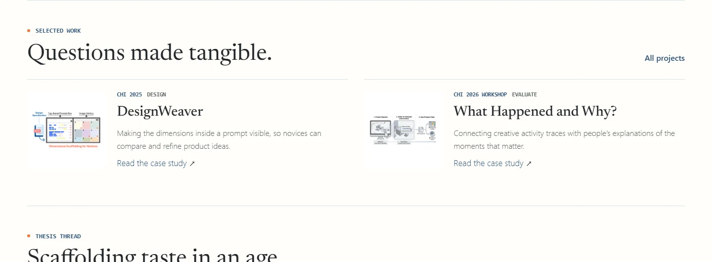
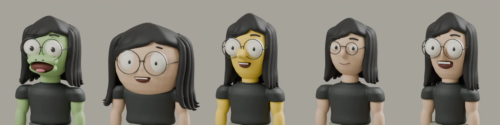
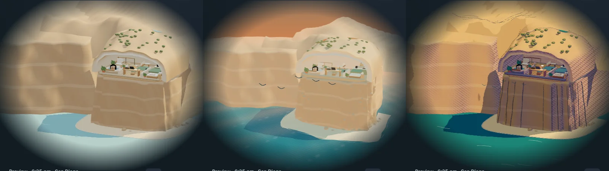

# Coastal home refinement

September 12, 2026, Pacific time. This checkpoint follows Sirui's review of `72ce1637d` and is integrated locally on `main`. Captures show the implemented site and actual Blender models. They are not generated concept mockups.

[Local preview](http://localhost:8080/?cinematic=live) · [Implementation](../../research-studio-implementation.md) · [Blender sources and provenance](../../../artwork/coastal-home/PROVENANCE.md)

## Quieter homepage

The figures are now small, uncropped thumbnails beside the title, summary, and case-study link. The homepage starts in 2D at every width; explicit mode choice survives for the session. Public 3D controls are limited to three style icons, Look around / Back inside, and pause. Refresh chooses a different avatar from the previous arrival. The authored San Diego routine continues automatically.

Comparable before/after captures put the previous checkpoint on the left and this refinement on the right: [1440 × 1000](home-1440.webp), [1280 × 800](home-1280.webp), [768 × 1024](home-768.webp), [390 × 1000](home-390.webp), and [current full homepage](home-full.webp).

## Actual models and the coast

Left to right: Lizard, South Park, Simpsons, Ghibli, Rick and Morty. These are Cycles renders of the meshes exported to the browser. Continuous skin, hair surfaces, fitted clothing, recessed mouths, and blended arm/leg weights replace the earlier disconnected masses. A framed portrait on the kitchen wall matches the active avatar across subsequent style and avatar changes.

Left to right: Architectural, Realistic, Illustrated. A stone vault meets the inland terrain, the inhabited floor is supported by a tall cliff, and a sloping beach meets the modeled water below. Receding headlands continue the coast. Realistic adds fractured relief, perspective, physical water, and environment lighting; Illustrated adds modeled erosion strokes, graphic surf, outlines, and printed shadow patterns. All three use geometry for the scenery.

[Study treatments](styles-work.webp) · [Ocean-facing onsen](styles-soak.webp) · [Lounge close-up](lounge.webp) · [Breakfast and wall portrait](breakfast.webp) · [Connected cutaway](connected-home.webp) · [Live scene recording](live-scene.webm)

The overview removes the roof and attached vegetation together. Room cameras avoid the hillside and keep the onsen view clear of the lounge chair. Both the onsen pose and lounge chair face the Pacific. The live recording shows exported character animation, smooth camera travel, and style changes.

## Measurements

Serial Chromium on Windows, RTX 3080 Ti through ANGLE/D3D11; no CPU/network throttle. Each style has three seconds of warmup and four seconds of live measurement. Mobile is 390 × 1000 touch/DPR emulation on this computer, not a physical phone. The canvas caps DPR at 1.5.

| View                        | Ready after choosing 3D | Architectural | Realistic | Illustrated |
| --------------------------- | ----------------------- | ------------- | --------- | ----------- |
| Desktop 1440 × 1000         | 659 ms                  | 60.1 fps      | 60.1 fps  | 59.8 fps    |
| Mobile emulation 390 × 1000 | 439 ms                  | 59.8 fps      | 60.1 fps  | 59.9 fps    |

P95 animation-frame intervals were 16.7–16.8 ms. No scene resources were fetched before choosing 3D. The conservative largest-room/selected-avatar-plus-portrait budget is **3,541,714 bytes estimated gzip (3.38 MiB)**, under the 4 MiB compressed target. Random arrival selected South Park on desktop and Ghibli in mobile emulation; each remained fixed through its three style measurements. Local Jekyll transferred **8,031,841 bytes** and **6,645,717 bytes**, respectively, because those responses were uncompressed. The compression estimate does not establish production transfer size. The richer meshes cost more than the preceding checkpoint; these desktop results do not establish phone performance or spare GPU capacity.

[Raw measurements](scene-performance.json) · [Reproduction script](../../../bin/measure_coastal_home.cjs)

## Verification

- Four-size scene checkpoint: 34 passed, six viewport-specific skips. Coverage includes nonblank rendering, visible drag/zoom changes, room continuity, all five avatars, all three styles, activities and props, album focus/swap/drop, keyboard/touch, reduced motion, offscreen pause, hidden-tab recovery, and loading failure/retry.
- Final portrait and public-control regression checks: eight passed across four sizes. The test reads the portrait material actually rendered, including after style changes. Escape and exterior return labels stay synchronized.
- Final composed activity checks after rotating the lounge chair: four passed across four sizes.
- Homepage checkpoint: four passed, each covering light and dark at its viewport; overflow and runtime errors checked. The earlier sitewide gallery retains the broader route-family evidence.
- 161 Python checks, seven deterministic Node schedule/random-arrival tests, Black, changed-file Prettier, style contract, production `/al-folio` build, and diff whitespace checks passed.
- Override audit completed. The previously acknowledged edited overrides remain acknowledged; 76 untouched legacy entries still report their existing changes. This refinement does not broadly re-acknowledge them.

Full logs and PNG originals remain under `.jekyll-cache/visual-qa/refinement/`. The committed gallery is excluded from the built site. The isolated splat experiment and its [findings](../../../artwork/coastal-home/splat-lab/FINDINGS.md) are unchanged.

The characters remain editable stylized model studies; this checkpoint does not claim the concept boards' finished illustration quality or Sirui's approval of likeness. Animation contacts and movement follow authored clips and room paths, not a general physics or collision system.
