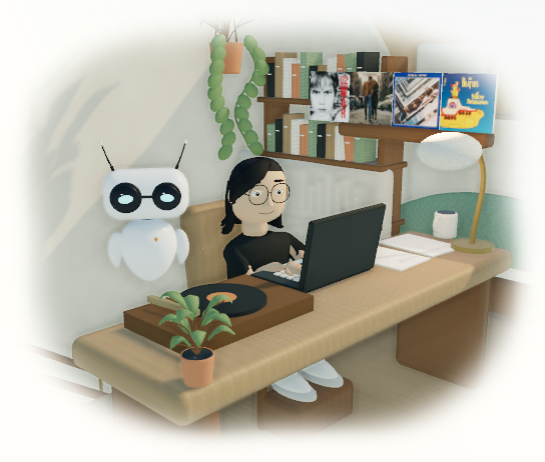
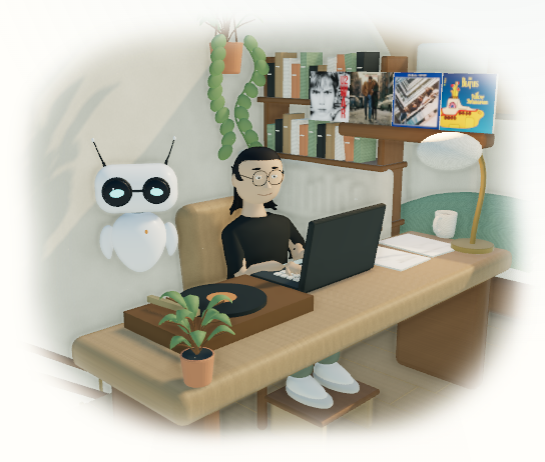
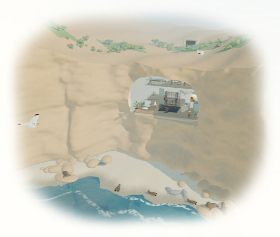
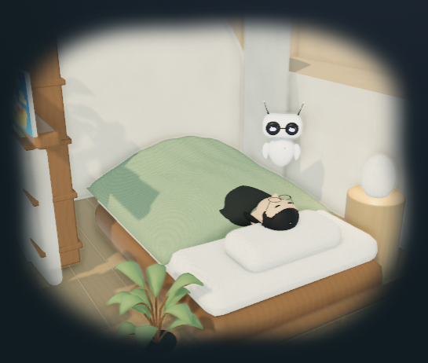
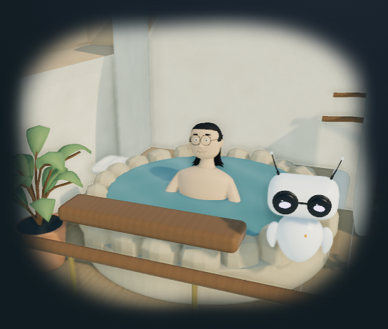
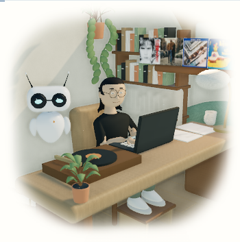

# October 1 coastal model checkpoint

This checkpoint refines the original adult figures, room objects and La Jolla coast from `0bf38b1da`. It uses the existing public Realistic renderer and the unchanged room, camera and contact manifest. The independent runtime lighting/water/record stream is verified after integration; these captures isolate the geometry change.

## Actual browser comparison

These are Chromium captures of the Docker site on port 8083 at 1440 × 1000. They are not generated concepts or Blender renders.

| View                   | Before                                       | After                                                            |
| ---------------------- | -------------------------------------------- | ---------------------------------------------------------------- |
| Study and fitted adult |           |                |
| Connected coast        |  |  |

The adult's longer torso and legs, quieter head/eyes, tapered jaw/neck, clear forehead, ear tuck and shoulder-length hair read at room scale. Slim separate fingers preserve the keyboard, cup and equipment contacts. The chair back has a lumbar bow; the open oak support meets both soles. The kitchen gains actual hollow ceramic sections, recessed coffee, a shaped plate and fruit bowl, and a Boolean-cut undermount sink. The capybara beach-party print remains the same supplied image for all five figures.

The outside changes use the actual connected mainland, carved cave and sloping beach. Inclined sandstone bedding and flattened fallen-rock forms follow the local geological references recorded in [provenance](../../../artwork/coastal-home/PROVENANCE.md). The original house is imagined, rather than a surveyed reconstruction.







Sleep inspection exposed a head past the pillow and shoes through the old cover. The source clip now fits the existing pillow without moving its room anchor; the authored drape clears the feet. Lizard's two tail bones recline along the mattress. Onsen inspection retains the chest waterline. The blanket and hair are authored surfaces; neither is a physical cloth or strand solver.

## Source and delivered asset evidence

All five editable `.blend` files and GLBs retain their named bones and fourteen clips. Direct front/profile/body studies remain in [portraits](../../../artwork/coastal-home/portraits/), and matched clay/material exterior/section plus seated, pull-up, dip and coffee studies remain in [reviews](../../../artwork/coastal-home/reviews/). For example, [Ghibli front](../../../artwork/coastal-home/portraits/ghibli-front.png), [profile](../../../artwork/coastal-home/portraits/ghibli-profile.png), [body](../../../artwork/coastal-home/portraits/ghibli-body.png) and [fitted seated pose](../../../artwork/coastal-home/reviews/ghibli-seated.png) show actual authored geometry.

`bin/review_coastal_models.py` inspects actual deformed source vertices and wrists at frames 1, 25, 49, 73 and 97 of eight clips for each avatar. Its [measurement report](../../../artwork/coastal-home/reviews/model-contacts.json) records every delivered GLB's SHA-256, bytes, material names, animation names and index-derived triangle count.

| Measurement                                                    | Result                                                                                                                                      |
| -------------------------------------------------------------- | ------------------------------------------------------------------------------------------------------------------------------------------- |
| Standing heights                                               | Ghibli 1.696 m; South Park 1.853 m; Simpsons 1.895 m; Rick and Morty 1.904 m; Lizard 1.940 m                                                |
| Authored keyboard, book, pull-up, dip, coffee and carry wrists | Maximum error below 0.000002 m against the source targets at the sampled key times                                                          |
| Seated sole height                                             | 0.21994 m for human figures, 0.21842 m for Lizard; board top 0.22 m                                                                         |
| Seated support footprint                                       | Both feet remain inside x ±0.245 m and y −0.69 to −0.29 m                                                                                   |
| Sleep                                                          | Head-envelope minimum 0.615 m; body minimum at least 0.524 m; all weighted foot vertices raycast below the actual cloth by at least 0.019 m |
| All 16 GLBs                                                    | 7,070,400 bytes versus 7,056,848 baseline; +13,552 bytes (+0.192%)                                                                          |
| All 16 GLB triangle indices                                    | 1,379,225 triangles; this includes all five avatar choices, rather than one rendered frame                                                  |
| Initial geometry selection                                     | 3,574,833 computed gzip-equivalent bytes for shell, coast, six rooms, default Lizard and animal masters; below the 4 MiB geometry budget    |
| Coast GLB                                                      | 169,708 bytes, 99,884 triangles; 70,728 fewer bytes than baseline                                                                           |

The gzip figure is computed from the GLBs for a consistent geometry-budget comparison. It is not a measured HTTP transfer size or the full page payload. The report's asset triangle counts likewise exclude procedural browser water, effects and rendering passes. Source wrist precision describes fixed authored endpoints, not an unrestricted whole-body dynamics solver or continuous guarantees between sampled times.

The house retains high-detail source geometry, a 24-sample neutral Cycles AO/diffuse-indirect bake, 32-step byte vertex colors and Draco compression. A semantic JSON comparison confirms the manifest's six rooms, actor/equipment/terrain anchors, stairs, camera grids and cutaway contracts are unchanged. Browser-fetched bedroom/Ghibli/Lizard GLBs were SHA-256-compared with the final disk files before final inspection.

## Rebuild and verification

The pass used the official Blender 4.5.9 LTS portable archive, verified against the official SHA-256 list. Native Blender mouse/keyboard control was unavailable; Python authored editable models and rendered review images. The [provenance rebuild instructions](../../../artwork/coastal-home/PROVENANCE.md#rebuild) remain the canonical entry point.

Run these from the repository root with the configured Blender executable:

```powershell
blender --background --python-exit-code 1 --python bin/build_coastal_home.py
blender --background --python-exit-code 1 --python bin/bake_coastal_light.py
blender --background --python-exit-code 1 --python bin/optimize_coastal_exports.py
blender --background --python-exit-code 1 --python bin/render_coastal_review.py
blender --background --python-exit-code 1 --python bin/render_coastal_contacts.py -- --avatars-only
blender --background --python-exit-code 1 --python bin/review_coastal_models.py
```

The full generator needs no ignored caches. For a focused room-source change, append `-- --room=sleep` (or another of the six room IDs) to both bake and optimization commands; the reports retain the other room records. For a focused character rebuild, append `-- --avatar=ghibli` to the generator. Rebuilds preserve public IDs and regenerate the affected source studies and exports.

Actual Docker room captures cover all six rooms, exterior and overview, plus all five seated figures at 1440 × 1000. Representative outside/study captures also cover 1280 × 800, 768 × 1024 and 390 × 1000. The retained fast-loop files and state JSON are under `.jekyll-cache/visual-qa/coastal-models-before`, `coastal-models-after-{1440,1280,768,390}` and `coastal-models-poses`.

Completed checks include 166 Python tests; the style contract; changed Python compilation; binary Draco, source/skin/clip, camera/contact and gzip asset checks; and a production Docker Jekyll build with `/al-folio`. Targeted Chromium tests passed seven cases across desktop and mobile, with the desktop-only exclusion for touch pinch: light/dark nonblank composition, visible drag/zoom pixel changes, all five avatars sharing one actor/art/album state, and mobile pinch/Now recovery. The [live contact record](live-contacts.json) samples all five pull-ups, Ghibli's dip, coffee grinding and carrying, with no runtime errors and grip error below 0.000003 m. Actual [pull-up](after-pullup.png), [coffee grind](after-coffee-grind.png) and [cup carry](after-coffee-carry.png) captures retain the rendered results. The longer initial capture harness was interrupted by a hidden authoring select; the bounded final run inspected the nested details state and completed. Broader sitewide and combined-runtime release checks belong to the integration checkpoint.

This pass adds no imported model, commercial texture, generated concept image, reconstructed physical residence, fluid simulation or film-production-quality claim. The faces retain stylized interpretations, and the static cloth/hair retain authored poses.
