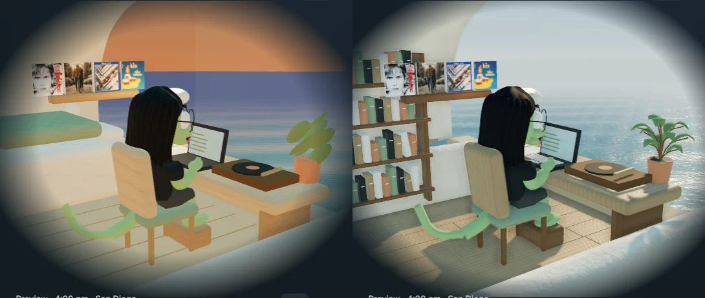
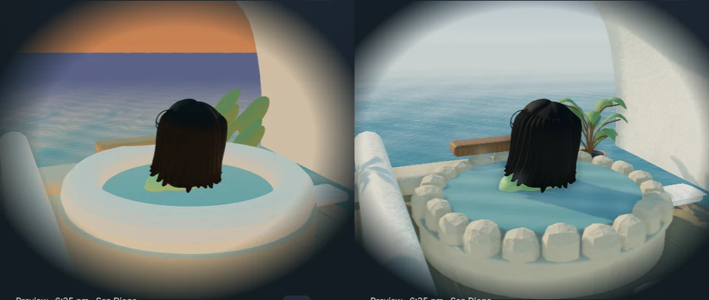

# Realistic coastal home

September 2026. This refinement follows Sirui's review of `564ca01fe` and is integrated locally on `main`. The images below are captures of the implemented website, not generated concept art.

[Local preview](http://localhost:8080/?cinematic=live) · [Implementation](../../research-studio-implementation.md) · [Editable Blender sources and provenance](../../../artwork/coastal-home/PROVENANCE.md) · [GPT-7 experiment note](../../design-experiment-backlog.md)

## One public rendering direction

3D now uses Realistic, including sessions with an obsolete saved style. The public style picker is removed. Architectural and Illustrated remain deferred authoring experiments under `?scene-lab=1`; Sirui's GPT-7 handoff requires meaningful differences in form, materials, composition, and expression before reconsidering them.

The homepage still starts in 2D at every width. An explicit session choice is remembered. Refresh selects a new avatar; mode changes retain it and the shared album state. Public scene controls are Look around / Back inside and motion pause.

The Blender source adds individual oak boards, fitted shelves and books, joinery, keyboard keys, a ceramic cup, thin plant leaves and stems, cabinet fronts, paper lanterns, a braided rug, and folded linen. The record remains clear of the cup. The kitchen camera now shows Sirui and his wall portrait without the study shelves blocking the view.

An irregular stone rim replaces the smooth onsen ring. Physical-scale material variation, soft contact shadows, warm practical lights, onsen ripples, and restrained vapor support the geometry. The cliff has continuous fluting and erosion instead of detached relief chips. Procedural sky lighting and haze, moving water, shoreline wash, and a live reflection of the actual house and cliff establish the coast. No scenic image is placed behind the home.

[Exterior comparison](compare-outside.webp) · [Breakfast comparison](compare-breakfast.webp) · [Night comparison](compare-coding.webp) · [Connected overview](overview.webp) · [Lounge](lounge.webp) · [Live scene recording](live-scene.webm)

The window's invisible click target no longer draws a faint rectangle across the night sea or contributes to contact shadows. Rendering stops offscreen or in a hidden tab; motion pause and reduced motion retain composed poses.

Asset creation uses Blender's background Python API. Native Blender mouse/keyboard control was unavailable in this session. The official portable Blender 4.5.9 LTS build produced the editable `.blend` and optimized GLBs; these are modeled assets, not images presented as geometry.

## Homepage spacing

The Thesis thread / Home base / Methods strip uses a transparent surface with consistent spacing. Its old dark card backgrounds and shadows are removed. Mobile uses label/value rows. The homepage keeps a 20–32 px minimum side gutter before the centered desktop margin takes over, aligning the facts with the headline and section rules.

Comparable facts-strip captures, before on the left and after on the right: [1440 × 1000](facts-1440.webp), [1280 × 800](facts-1280.webp), [768 × 1024](facts-768.webp), and [390 × 1000](facts-390.webp). Each component was captured at the stated viewport; the mobile row grows vertically to accommodate readable values.

| Current homepage | Light                           | Dark                           |
| ---------------- | ------------------------------- | ------------------------------ |
| 1440 × 1000      | [Capture](home-light-1440.webp) | [Capture](home-dark-1440.webp) |
| 1280 × 800       | [Capture](home-light-1280.webp) | [Capture](home-dark-1280.webp) |
| 768 × 1024       | [Capture](home-light-768.webp)  | [Capture](home-dark-768.webp)  |
| 390 × 1000       | [Capture](home-light-390.webp)  | [Capture](home-dark-390.webp)  |

## Measured cost

Serial Chromium on Windows with an RTX 3080 Ti through ANGLE/D3D11, without CPU or network throttling. The study uses three seconds of warmup and four seconds of measurement; the exterior uses 1.5 seconds and four seconds. Mobile is viewport/touch/DPR emulation on this computer, not a physical phone. It runs after desktop and can benefit from browser/GPU caches. The scene caps DPR at 1.5.

| View                        | First verified 3D frame after choosing 3D | Live study | Live exterior |
| --------------------------- | ----------------------------------------- | ---------- | ------------- |
| Desktop 1440 × 1000         | 7,750 ms                                  | 60.1 fps   | 59.7 fps      |
| Mobile emulation 390 × 1000 | 1,468 ms                                  | 60.1 fps   | 59.9 fps      |

P95 animation-frame intervals were 16.7–16.8 ms. The first desktop activation remains a noticeable startup cost; steady animation performance does not imply instant startup. Arrival selected Simpsons on desktop and Lizard in mobile emulation; subsequent measurements use Lizard in both views.

No 3D resources were requested before choosing 3D. Draco compression makes the conservative largest occupied-room/selected-avatar/portrait payload **2,827,181 bytes (2.70 MiB)** even with uncompressed HTTP delivery. The separate gzip estimate is **1,714,023 bytes (1.63 MiB)**. Other rooms stream afterward. The decoder and postprocessing dependency closure are included in this budget. These are local measurements, not production-network or physical-phone results.

[Raw measurements](scene-performance.json) · [Reproduction script](../../../bin/measure_coastal_home.cjs)

## Verification

- Scene matrix: **38 passed, six viewport-specific skips**. This covers nonblank WebGL, visible orbit/zoom changes, room continuity, all five avatars and wall portraits, composed activities, clock/exploration state, album focus/playback/swap/drop/return, keyboard/touch, reduced motion, offscreen pause, hidden-tab recovery, and model/decoder failure with retry.
- After the gutter adjustment, **nine additional scene checks passed, three viewport-specific skips**, covering public controls, composition/orbit/zoom, and touch pinch at the four sizes.
- Final homepage checkpoint: **four passed**, each inspecting light and dark, overflow, and runtime errors. The preceding sitewide gallery retains broader route-family evidence.
- **162 Python checks**, **seven deterministic schedule/random-arrival tests**, changed-file Prettier, style contract, Black, the scene skill validator, and diff whitespace checks passed.
- Production Jekyll build with `/al-folio` passed. Its output contains the final gutters, rendering modules, and same-origin decoder; editable sources and evidence remain excluded from the built site.
- Override audit completed; **80 untouched legacy overrides still report `local_changed`**. This pass does not broadly acknowledge unrelated overrides.

The Windows test runner now preserves the D3D11 setting when workers reload its configuration. Earlier interrupted software-WebGL runs were diagnostic and are not counted as acceptance. Original PNGs and logs remain in `.jekyll-cache/visual-qa/realism/`; curated captures and measurements are committed here.

The characters remain stylized model studies; this pass does not establish Sirui's approval of likeness or match the concept boards' illustration quality. Motion uses authored clips and room paths, not a general physics/collision solver. The separate [splat experiment and findings](../../../artwork/coastal-home/splat-lab/FINDINGS.md) are unchanged.
