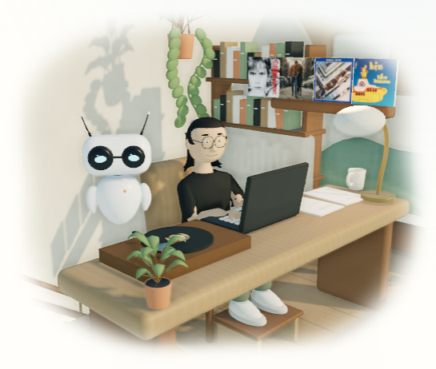
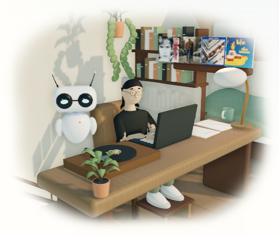
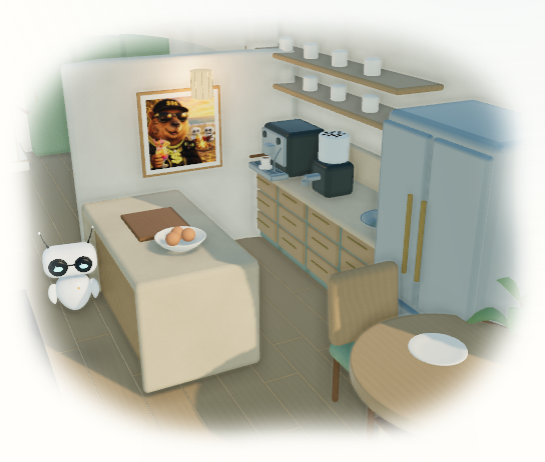
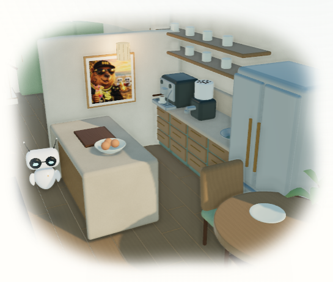
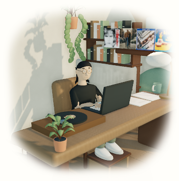
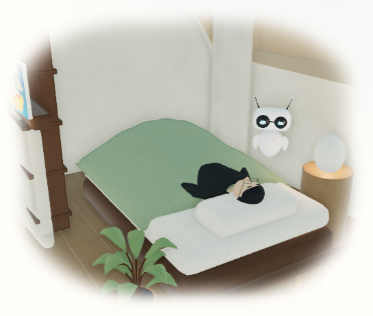
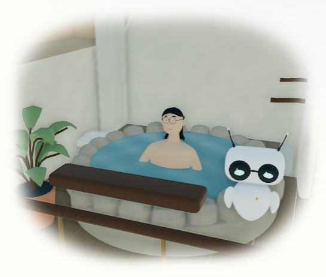

# October 1 Realistic portrait and warm finishes

This bounded checkpoint starts from `d2878aa30`. It refines the original Ghibli figure and separates the house materials at the actual homepage footprint. The other four avatar sources, capybara print, terrain, room contacts, camera manifest and public controls retain their existing contracts.

## Comparable browser views

These are original Chromium screenshots of the Docker site on port 8083 at 1440 × 1000, device scale 1. The same work preview, afternoon scene lighting, Realistic renderer and camera are used. Reduced motion holds a comparable authored pose. The final study, kitchen and Ghibli GLBs were fetched and SHA-256-compared against the source files before capture. An earlier interim capture taken during Jekyll regeneration is excluded.

| View                        | Before                                | After                                              |
| --------------------------- | ------------------------------------- | -------------------------------------------------- |
| Seated figure, desk and mug |      |  |
| Oak, stone and ceramics     |  |      |

The narrower head and finer glasses read at scene size. The face has a calmer jaw, narrower temples and a tapered neck; the long black hair clears the lenses and stays behind the ears and collar. The shirt gains a doubled hem and shallow lower-torso folds. Darker ash joinery, warm oak surfaces, olive cabinetry and a distinct celadon mug give the interior more material separation. Existing porcelain receives a restrained glaze. All geometry and supplied art remain original.







The figure remains an animated-film interpretation. Hair and cloth are authored surfaces; this pass introduces no strand, cloth or whole-body dynamics solver. Material changes are deliberately quiet. Mobile reduces the face to a small silhouette, so close likeness is judged in the separate source studies as well as the live room.

## Source and asset measurements

The original [front](before-ghibli-front.png), [profile](before-ghibli-profile.png) and [body](before-ghibli-body.png) portraits are retained here. Current source portraits are in [portraits](../../../artwork/coastal-home/portraits/), and the current [seated](../../../artwork/coastal-home/reviews/ghibli-seated.png), pull-up, dip and coffee-preparation renders are in [reviews](../../../artwork/coastal-home/reviews/). All are direct Blender renders, rather than generated concepts.

- The authored face-width scale is approximately 19% smaller. The Ghibli model stands 1.657 meters; its long-bone rig and activity anchors are unchanged.
- All five delivered avatars retain fourteen clips. Actual deformed source vertices and fixed wrists were checked at five times in eight activities per avatar; maximum wrist error is below 0.000002 meters. Soles retain the 22-centimeter support, and the pillow/duvet checks pass.
- The finish refresh preserves an identical SHA-256 over every source object's matrix, mesh coordinates and polygon connectivity. It reassigns 724 existing mug faces from linen to ceramic. No room or terrain geometry moves. The manifest's repository contents are unchanged.
- All sixteen home/wildlife GLBs total **7,077,116 bytes**, versus 7,070,400 before: **+6,716 bytes, about 0.095%**. Ghibli adds 2,164 indexed triangles; every static mesh retains its previous triangle count. The aggregate across all choices is 1,381,389 triangles, not the rendered frame count.
- The computed gzip sum for the complete room/coast/wildlife set plus Ghibli is **3,744,542 bytes**. This is a consistent geometry-budget calculation, excluding the other four avatars. It is not measured HTTP transfer or full-page payload.

The [asset/contact report](../../../artwork/coastal-home/reviews/model-contacts.json) records binary GLB headers, SHA-256 values, bytes, triangles, materials, clips and source contacts. The [finish report](../../../artwork/coastal-home/reviews/warm-finishes.json) records unchanged source geometry. [Browser measurements](measurements.json) retain the baseline, rendered states and asset comparison.

## Focused rebuild and validation

Use the verified official Blender 4.5.9 LTS executable from the repository root:

```powershell
blender --background --python-exit-code 1 --python bin/build_coastal_home.py -- --avatar=ghibli
blender --background --python-exit-code 1 --python bin/refresh_coastal_finishes.py
blender --background --python-exit-code 1 --python bin/optimize_coastal_exports.py -- --interiors-only
blender --background --python-exit-code 1 --python bin/render_coastal_contacts.py -- --avatar=ghibli --avatars-only
blender --background --python-exit-code 1 --python bin/render_coastal_review.py
blender --background --python-exit-code 1 --python bin/review_coastal_models.py
```

The canonical full house builder applies the same finish definitions and creates the mug directly with its ceramic material. The focused refresh retains the existing neutral 24-sample Cycles contact/indirect bake because geometry is unchanged; optimization retains the 32-step byte colors and Draco mesh compression. The cliff export is excluded from the focused refresh.

Completed source/build checks: 166 Python tests, changed Python compilation, style contract, targeted formatting, binary/source contact measurements, unchanged manifest, served-file hashes, and a production Docker Jekyll build with `/al-folio`. These two targeted desktop Chromium cases passed:

- `coastal home: the lab stays minimal and realistic with obsolete saved styles`
- `coastal home: all five avatars retain one actor, shared wall art and album state`

Direct screenshot inspection covered the comparable study/kitchen views, current 390-pixel study and actual sleep/soak states, with no runtime errors. The coordinator owns combined light/dark, four-viewport and site/room release checks.

The original mobile pinch test passes its projection/pixel-change assertions, then times out at `desk-scene.spec.js:817`: it taps the hidden Now button without opening the newly collapsed lab menu. Its trace and failure screenshot are retained under `.jekyll-cache/visual-qa/realistic-refinement-mobile-checks/`. This is a failed complete test, not a mobile acceptance pass. The coordinator owns the scene tests and has corrected the menu locator for the integrated rerun.

## Integrated acceptance on main

The coordinator integrated the model checkpoint as `dc67a2c29`. Four minimal-control and eight light/dark composition cases pass at the four standard viewports, including real orbit/zoom pixel differences and connected room/exterior navigation. The corrected mobile pinch/Now case passes completely. An initial mobile dark-edge failure in the wider page mask was repaired with a three-pixel interior fade guard; all eight light/dark edge cases pass. The final desktop minimal-control view passes with that guard in place. Evidence is under `.jekyll-cache/visual-qa/october-integrated-room/`, `october-integrated-edges/`, `october-integrated-pinch/` and `october-room-final-preview/` in the main checkout.

The root Docker server's Ghibli, study, kitchen and shell GLBs were SHA-256-compared with their integrated source files. The combined homepage checkpoint passes all four standard sizes in light/dark, and the final `/al-folio` production build succeeds. These checks establish this local integration, rather than a complete release matrix or a new physical solver claim.
