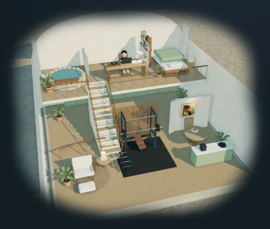
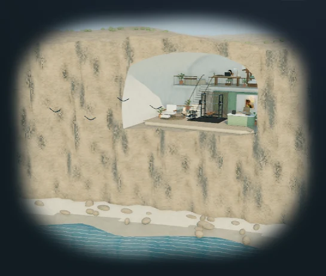
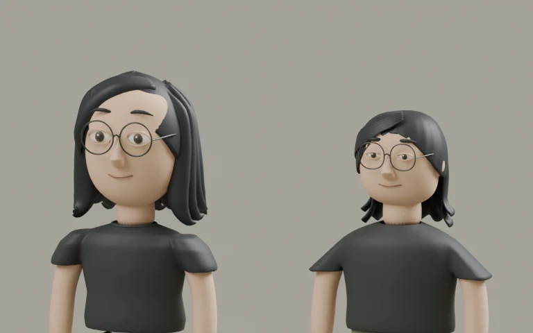

# Two floors in one coastal cliff

September 13, 2026, following Sirui's review of `c25f20546`. Implemented locally on `main`.

[Local preview](http://localhost:8080/?cinematic=live) · [Editable Blender sources](../../../artwork/coastal-home/PROVENANCE.md) · [Scene contract](../../homepage-desk-scene-brief.md)

## The house and shore

The study, sleeping alcove and ocean-facing onsen occupy an upper gallery, 2.6 metres above the kitchen, lounge and gym. Fifteen closed risers connect the floors through an opening in the upper slab. The lower route passes around the stair and through a clear passage between the gym and kitchen. Room furniture, interactive records, papers, lights and actor anchors move with their floor.

The cave is excavated from a continuous mainland mesh. Its supporting cliff, ceiling and side walls meet at matching boundaries; the previous detached arch and pedestal are gone. The beach follows a continuous shoreline beneath the cliff, and the ocean's shallow-water wash follows that same geometry. Only the local ceiling lifts away for a cutaway view. The surrounding mountain remains present.

[Sirui's rejected exterior capture](before-exterior.webp) · [Current night exterior](exterior-night.webp). The earlier screenshot is supplied review evidence, not a controlled camera/time comparison. The new exterior deliberately frames the continuous shore and inhabited section together. No generated image is used as a scenery background.

The gym retains the power rack, loaded barbell, bench, dumbbell stand and rubber floor. The same capybara print hangs in the kitchen for every avatar. The study's small corner plant leaves the face visible. From the onsen, the camera looks past Sirui toward the actual ocean.

[Study](work.webp) · [Gym](workout.webp) · [Kitchen](breakfast.webp) · [Onsen](soak.webp) · [Lounge](lounge.webp) · [Sleeping alcove](sleep.webp)

## Sirui's character models

All five variants were re-authored in Blender against Sirui's actual portrait and supplied character studies. The human faces use a broader jaw, a higher open forehead, lower brows and revised eye, nose and glasses proportions. The Ghibli interpretation uses smaller almond-shaped eyes and a smaller head. The hair is side-parted, tucked behind the ears and layered across the back of the neck. Sirui remains clean-shaven, with long black hair and glasses.

The shirts are continuous meshes with connected sleeves; the trousers connect at the waist and seat. Lizard has rebuilt arms, hands, feet and a continuous skinned tail. Each character retains the ten activity clips and the established prop-contact convention.

| Interpretation | Same-camera before / after                  | Front, profile and full body               | In the website                     |
| -------------- | ------------------------------------------- | ------------------------------------------ | ---------------------------------- |
| Lizard         | [Comparison](character-lizard.webp)         | [Model review](review-lizard.webp)         | [Study](study-lizard.webp)         |
| South Park     | [Comparison](character-south-park.webp)     | [Model review](review-south-park.webp)     | [Study](study-south-park.webp)     |
| Simpsons       | [Comparison](character-simpsons.webp)       | [Model review](review-simpsons.webp)       | [Study](study-simpsons.webp)       |
| Ghibli         | [Comparison](character-ghibli.webp)         | [Model review](review-ghibli.webp)         | [Study](study-ghibli.webp)         |
| Rick and Morty | [Comparison](character-rick-and-morty.webp) | [Model review](review-rick-and-morty.webp) | [Study](study-rick-and-morty.webp) |

The comparison's left image comes from committed baseline `c25f20546`; both sides use the same Blender review camera. These are stylized models, not a claim of photographic likeness or equivalence to the generated concept art. Likeness is a visual judgment, not something the automated checks establish.

Blender 4.5.9 LTS ran through its Python API in background mode. Native Blender mouse/keyboard control is unavailable in this session. The `.blend` files contain the actual editable meshes, rigs and clips; the review pictures are renders of those meshes.

## Movement and page composition

[Live recording: gym, stair climb and ocean-facing onsen](live-stairs.webm). This records the rendered canvas; the page captures below show its feathered edge. The clock crosses the authored 18:15 Pacific routine boundary, and Sirui walks around the stair, climbs its treads and settles into the upper onsen. The camera is deliberately moved to the overview for review. Foot placement uses a two-bone correction against floor and tread heights. Circulation remains authored paths, not a general physics or collision simulation.

The site still opens in 2D at all widths. Explicit mode choices last for the session; refresh chooses a different avatar. Realistic remains the only public rendering style. Public controls remain 2D/3D, Look around / Back inside, and motion pause.

Public captures use September 11, 17:45 Pacific, one random arrival avatar, and independently selected page themes. The existing asymmetric alpha edge and padded thesis/home-base/method row are retained.

| Viewport    | Light page                      | Dark page                          |
| ----------- | ------------------------------- | ---------------------------------- |
| 1440 × 1000 | [Capture](scene-noon-1440.webp) | [Capture](scene-evening-1440.webp) |
| 1280 × 800  | [Capture](scene-noon-1280.webp) | [Capture](scene-evening-1280.webp) |
| 768 × 1024  | [Capture](scene-noon-768.webp)  | [Capture](scene-evening-768.webp)  |
| 390 × 1000  | [Capture](scene-noon-390.webp)  | [Capture](scene-evening-390.webp)  |

## Verification

- Scene matrix: **46 passed, six intentional device-specific skips** across four viewport projects. Includes nonblank WebGL, visible orbit/zoom changes, keyboard and touch interaction, repeated avatar/mode changes, shared capybara art, album focus/play/swap/drop/return, reduced motion, clock previews, hidden-tab recovery and mesh/decoder failure recovery.
- Homepage checkpoint: **four passed**, covering the four requested widths, light/dark composition, overflow and runtime errors.
- Python: **163 passed**. Routine/navigation: **nine passed**, including midnight, noon, weekends, daylight-saving changes and routes between all 36 ordered room pairs. Exported actor anchors are checked against the manifest floor coordinates.
- Targeted Prettier, Black, style contract, `git diff --check`, and production Jekyll build with `/al-folio` passed. The existing **80 local overrides** remain acknowledged; no new override acknowledgement was needed.

Serial Chromium measurements on Windows with an RTX 3080 Ti and no CPU/network throttle. The app preview was paused. Mobile is viewport/touch/DPR emulation on this same computer, not a physical-phone result. Desktop runs first; caches may benefit the second measurement. See [full measurements](performance.json) for first-frame latency, frame rates, draw calls and both raw HTTP and gzip-estimated payload sizes. No 3D resources load before choosing 3D.

| View                        | First rendered frame | Study    | Gym      | Exterior |
| --------------------------- | -------------------- | -------- | -------- | -------- |
| Desktop 1440 × 1000         | 4,869 ms             | 60.0 fps | 59.9 fps | 60.0 fps |
| Mobile emulation 390 × 1000 | 1,049 ms             | 59.9 fps | 59.9 fps | 59.9 fps |

The conservative initial download is **3,561,801 bytes (3.40 MiB)** as uncompressed HTTP, or **2,279,851 bytes (2.17 MiB)** using the gzip estimate. That includes the engine, loaders, decoder, runtime, manifest, edge mask, wall print, shell, coast, largest room and largest avatar. The GLBs themselves use Draco geometry compression.

Full captures, export logs and test output remain under `.jekyll-cache/visual-qa/section/`. Model review renders and sources remain under `artwork/coastal-home/`, excluded from the production site.
