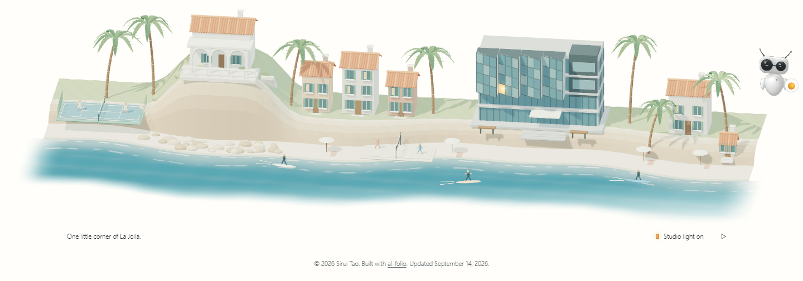
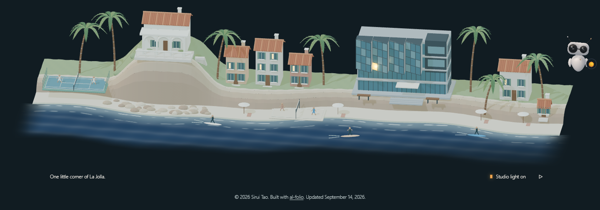

# La Jolla footer: implementation evidence

September 14, 2026. Local preview: `http://localhost:8080/#la-jolla`.

The footer now contains an original Blender-authored coastline, including Spanish cottages, an arcaded cliff villa, palms, a tennis court, beach volleyball, surfers, and the DIB's folded glass bays. A separate pane and local light mark Sirui's third-floor corner, based on his supplied photo annotations. The coast is an illustrative composition, not a map; the light is not an occupancy indicator.

The [previous footer](before-footer.png) was only the credit bar. Its copyright, al-folio credit, and update date are retained beneath the new scene. Full-size captures cover morning, noon, afternoon, and evening at 1440×1000, 1280×800, 768×1024, and 390×1000. Filenames identify the viewport and theme.

On phones, the closer view starts at the studio. Horizontal touch gestures and Left/Right keys reach the [west coast, villa, and tennis court](phone-west-coast.png); the light button returns to the studio. The vertical page scroll remains native.

## Actual assets and rendering

- Editable source: [`la-jolla.blend`](../../../artwork/la-jolla/la-jolla.blend), reproduced with [`build_la_jolla.py`](../../../bin/build_la_jolla.py).
- The model is **732,992 bytes** (715.8 KiB), with approximately **72,868 triangles** before the browser's procedural ocean replacement. It is batched by material and Draco-compressed.
- The poster is an actual transparent Cycles render, compressed to WebP. It remains available with [JavaScript disabled](desktop-1440-no-javascript.png) or [WebGL unavailable](desktop-1440-graphics-fallback.png).
- Soft directional/contact shadows, a generated reflection studio, glass and matte materials, broken foam, shallow-water color, small waves, palm movement, and whole-figure surfer motion.
- The transparent output pass unpremultiplies before tone mapping and restores premultiplication afterward, preventing a bright fringe at the fading water edge. The homepage finishing utility keeps its previous default; the footer opts in explicitly.

## Verification performed

- **Four sizes × four themes:** all 16 final composition/window checks passed. Tests inspect nonblank image statistics and actual changed canvas pixels after the studio-light control, rather than trusting a ready flag alone.
- **Behavior:** actual moving pixels, no renderer/model request at the top of the long homepage, pause, offscreen suspension/recovery, both Page Visibility branches, horizontal touch and keyboard exploration, reduced motion, context loss/restoration, failed model loading, and no-JavaScript fallback passed. Hidden-document behavior is exercised with deterministic Page Visibility events because headless tabs do not reliably become hidden.
- **Integration:** project, blog, and publications footers render; AI profiles remain undecorated. No horizontal page overflow in the checked views. Existing homepage light/dark scene composition, orbit, and zoom regression checks also passed.
- **Source/build:** targeted Prettier, Black, style contract, 163 Python tests, `git diff --check`, and the production Jekyll `/al-folio` build passed. Built entry/runtime/finishing modules, model, and poster match source SHA-256 hashes. Baseurl links and the exclusion of Blender authoring files were checked.
- **Overrides:** the audit reports the existing 80 local overrides. Only the changed footer include and main Sass entry acknowledgements were updated; unrelated override drift was preserved.

## Local performance sample

| Chromium viewport | Footer scroll-to-ready | Observed render updates |
| ----------------- | ---------------------: | ----------------------: |
| 1440×1000         |                 696 ms |           30.0 / second |
| 390×1000          |                 776 ms |           30.4 / second |

These are short local Windows samples with assets served by Docker, not network or physical-phone benchmarks. The 30.4 sample includes sampling-boundary/on-demand redraws; ambient animation is scheduled with a 32 ms minimum interval. Raw records: [desktop](desktop-1440-performance.json), [emulated mobile](mobile-390-performance.json). The renderer caps pixel ratio at 1.5; ambient occlusion uses a bounded buffer. No autoplay render loop continues while the footer is offscreen, paused, reduced-motion, or the document is hidden.

The miniature uses simplified crafted forms and is ready for Sirui's visual review. [Implementation brief](../../la-jolla-footer.md) and [provenance](../../../artwork/la-jolla/PROVENANCE.md) record the scope and reproduction commands.
