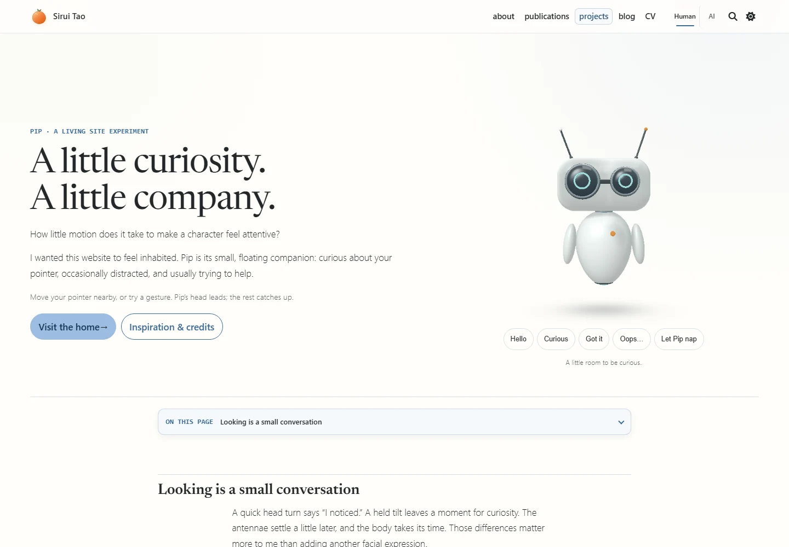
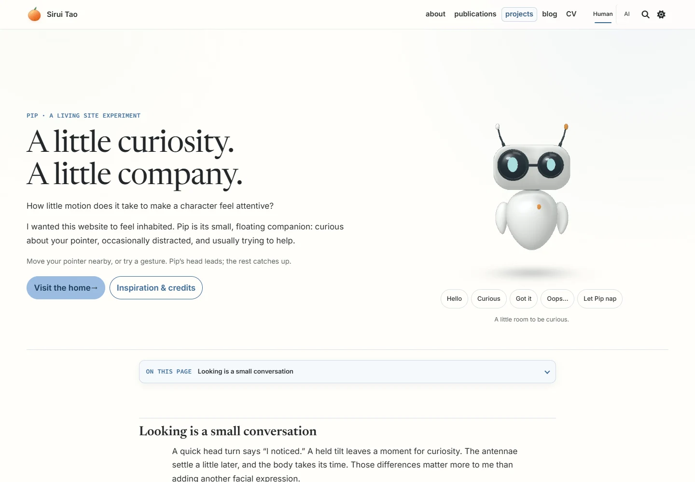
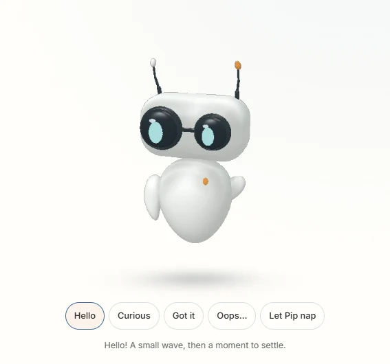
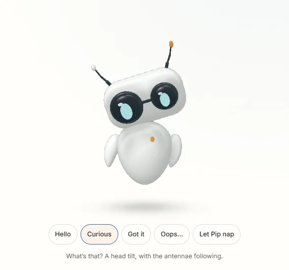
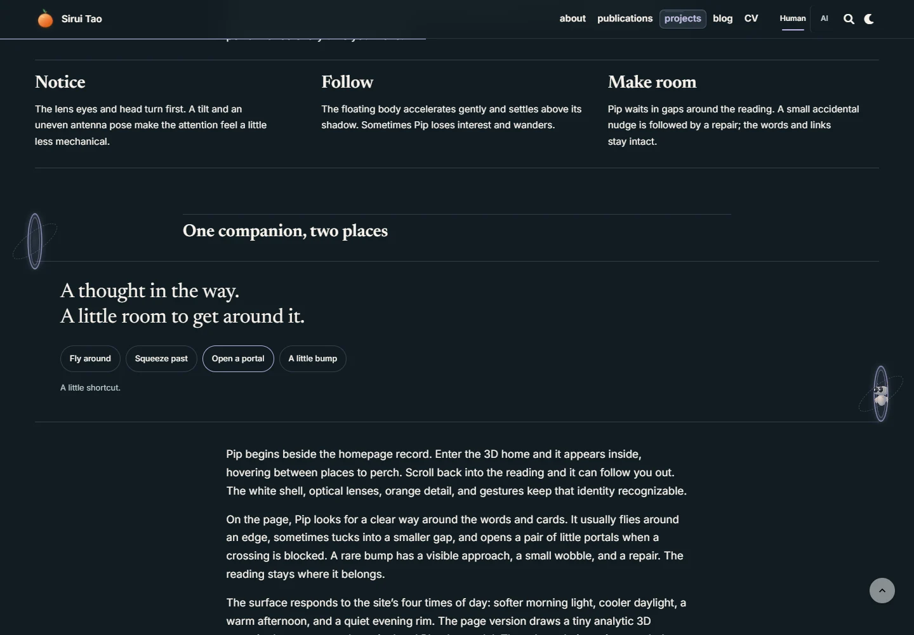

# Pip: expressions and page encounters

September 14, 2026. Local review at [Pip’s project page](http://localhost:8080/projects/pip/). This follows the [Reachy Mini / EVE pass](../pip-reachy/README.md), starting from `b1b8a3a54`. It refines Pip’s model and its relationship to page elements; it does not claim a new house or Sirui-avatar redesign.

## Shape and expression

Hollow eye rings became filled elliptical pupils with separate catchlights. They widen, squint and wink independently. Softer charcoal bezels, a shorter rounded head, a fuller tapered ceramic body, curved flippers and shorter antennae make the silhouette easier to read at page scale. Hello has a clear wave; curiosity tilts the head and offsets the antennae; surprise opens the eyes and flippers. Both the small page portrait and Blender model use the shared motion controller.

The `.blend`, articulated GLB and transparent Cycles poster were rebuilt through Blender 4.5.9’s background Python API. These are original model/render assets, not new image-generated concept art. See [source and provenance](../../../artwork/pip/PROVENANCE.md).

| Before, 1440 × 1000                         | After, 1440 × 1000                                  |
| ------------------------------------------- | --------------------------------------------------- |
|  |  |

| Hello                                         | Curious                                             |
| --------------------------------------------- | --------------------------------------------------- |
|  |  |

[Actual Blender render](blender-model.webp) · [study](room-work.webp) · [ocean-facing onsen](room-soak.webp). Small portrait lighting: [morning](pip-morning.webp), [noon](pip-noon.webp), [afternoon](pip-afternoon.webp), [evening](pip-evening.webp).

## Encounters with the page

The planner uses live text-line rectangles and complete card/control bounds. It normally flies around obstacles, slowing before corners. A squeeze shrinks in place, folds the flippers, traverses a gap that fits, and expands after arrival. A blocked crossing uses two portals at clear endpoints; the position changes only while Pip has disappeared into the portal.

Accidents are deliberately rare. Pip approaches an available side or top/bottom edge before a small card wobble or heading stumble. The repair preserves text, links and document flow. Automatic attempts wait 85–150 seconds after the initial delay, with a 30% chance and additional proximity/clearance checks. Project visitors can also invite a flight, squeeze, portal or bump directly. New actions interrupt old ones; scrolling, nap, reduced motion, hidden tabs and navigation clear transient effects. Speech bubbles must fit in whitespace too.

[Tablet squeeze](squeeze-tablet.webp) · [mobile encounter](stumble-mobile.webp) · [project-card contact](encounter-projects.webp) · [blog-card contact](encounter-blog.webp) · [article-heading contact](encounter-article.webp).

The [live recording](pip-motion.webm) shows the revised gestures and the four public encounter buttons. This is browser-rendered motion. The [route inspection report](review.json) records the model in two rooms and reversible encounters on three actual reading routes.

## Responsive and failure checks

| Viewport    | Light                           | Dark                           |
| ----------- | ------------------------------- | ------------------------------ |
| 1440 × 1000 | [Capture](hero-1440-light.webp) | [Capture](hero-1440-dark.webp) |
| 1280 × 800  | [Capture](hero-1280-light.webp) | [Capture](hero-1280-dark.webp) |
| 768 × 1024  | [Capture](hero-768-light.webp)  | [Capture](hero-768-dark.webp)  |
| 390 × 1000  | [Capture](hero-390-light.webp)  | [Capture](hero-390-dark.webp)  |

Full reading pages: [desktop](page-1440.webp), [mobile](page-390.webp). The `project-*-light/dark.webp` files preserve the separate checkpoint’s keyboard-focus and credit excerpts.

- **24 public-route cases passed**, each in light/dark: home, Pip, projects index, blog index, a research-skills article and publications, at all four sizes. No horizontal overflow or runtime errors.
- **45 scene/companion checks passed**, with three explicit viewport-specific skips. Includes the public travel buttons, interrupted portals, restored bumps, keyboard/touch use, nap/navigation persistence, undecorated AI routes, one active owner, WebGL loss/recovery, failed-model fallback, nonblank rooms, orbit/zoom pixel changes and album sharing.
- **16 deterministic Node checks passed**, including rendered-footprint clearance along flight/squeeze routes, blocked crossings, bounded endpoints, interrupted gestures, motion settling, routine/DST and room navigation.
- **163 Python tests passed**; Black, targeted Prettier and the style contract passed.
- Production Jekyll build passed at `/al-folio`. [Hash and URL checks](production-verification.json) match all companion modules, the room adapter, model and poster; public controls, credits and prefixed links are present. Blender sources stay excluded from production assets.
- Override audit reports the existing 80 local overrides. This pass changes no plugin-owned override and does not acknowledge unrelated drift.

The first tablet run revealed that paragraph boxes consumed otherwise usable whitespace. Using rendered text lines fixed the dead invitation. The first mobile contact had no side clearance; top/bottom approaches fixed it. Final screenshots also exposed a bubble crossing a heading, so bubble placement now checks free space. These were corrected and the affected interactions rerun, rather than bypassing the failures.

## Runtime and limits

[Measurements](performance.json) use serial headless Chromium with ANGLE D3D11 on this Windows computer. Mobile is viewport/touch/DPR emulation on the same GPU, not a physical phone benchmark. Measurements use four seconds of animation after warmup, without network or CPU throttling.

| Surface                  | Desktop  | Emulated mobile |
| ------------------------ | -------- | --------------- |
| Default 2D Pip           | 60.1 fps | 60.1 fps        |
| Large gesture playground | 60.2 fps | 60.0 fps        |
| Realistic study          | 60.1 fps | 59.9 fps        |

The page portrait’s 95th-percentile frame interval was 16.8 / 16.7 ms; the playground’s was 16.7 ms in both runs. Error collections were empty. The default six companion modules total 17,862 bytes estimated gzip, excluding the project-only playground module. The GLB is 870,896 raw bytes. The conservative initial scene estimate, including Pip, is 2.75 MB gzip / 4.51 MB without compression. Actual local scene readiness varied from 5.35 seconds on the desktop cold run to 0.92 seconds in the later mobile run; these are serial local observations, not a controlled device comparison or a loading-time guarantee.

Pip remains an authored character, not a flight-physics or robotics simulator. A bounded visibility graph can choose a portal when no route is found within its search budget. There is no visitor study establishing that these interruptions improve reading; the live demos support Sirui’s own visual and motion judgment. Initial 2D still avoids Three.js and the robot GLB. Richer hand animation or new character art is a future refinement, not implied by passing geometry tests.

Full captures and test output remain in `.jekyll-cache/visual-qa/pip-expressive/`. Reproduce the model with `bin/build_pip.py`, route/gesture checks with `test/companion.test.mjs`, public encounters with `test/visual/companion.spec.js`, and measurements with `bin/measure_coastal_home.cjs`. Changes are integrated locally on `main`; this checkpoint does not include a production push.
