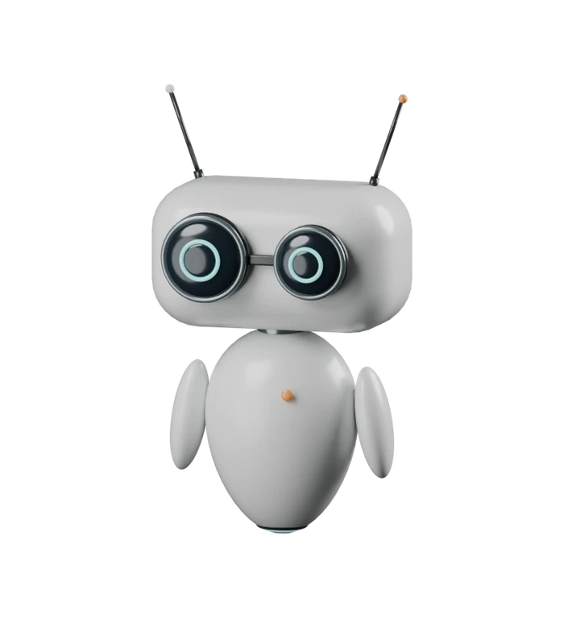
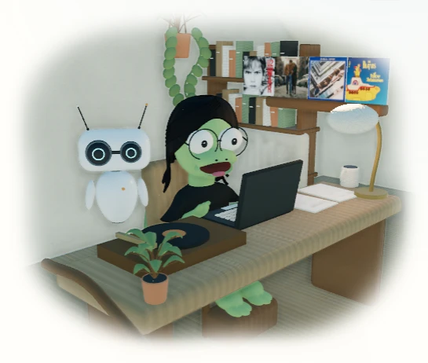
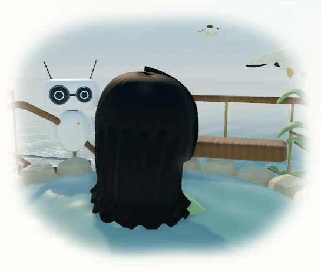

# Pip: Reachy Mini / EVE refinement

September 14, 2026. Local review at `http://localhost:8080/` and `/projects/pip/`. This checkpoint refines Pip and adds its project page; it does not claim a new sitewide redesign or approval of the existing Sirui avatars.

## What changed

The old rectangular visor became two unequal convex optical lenses. A rounded head, independently moving antennae, tapered ceramic shell and detached arms give Pip a clearer silhouette. Head tilts lead the body; antenna springs settle afterward. Hello, Curious, Got it and Oops are available in the project playground. The page, room and playground share one pose controller and one active owner.

The room model is an actual Blender export, with editable source, camera and lights in [`artwork/pip`](../../../artwork/pip/PROVENANCE.md). Blender’s background Python API was used; native mouse-driven modeling is not claimed. The default 2D page uses a small matching analytic WebGL portrait. Reachy Mini and EVE are credited on the public page; no SDK, recorded dance, film image or studio mesh is bundled.

## Before and after

The before image is the committed noon portrait from `a40e8b5e9`; the after is a new browser capture at the same 88 × 112 size. Docker was unavailable initially, so the before is existing rendered evidence from that exact starting commit, not a newly captured baseline.

| Before                                         | After, noon                                           | After, evening                              |
| ---------------------------------------------- | ----------------------------------------------------- | ------------------------------------------- |
|  |  |  |

Other light states: [morning](pip-morning.webp), [afternoon](pip-afternoon.webp).

The [live gesture recording](gestures.webm) shows Hello, Curious, Got it and Oops in the browser. These are moving rendered frames, not an image-generated proposal. Additional captures: [homepage](home-after.webp), [same world from outside](room-outside.webp).

## Responsive project page

These are full-page captures with composed reduced-motion poses. The separate interaction suite exercises live gestures and pointer motion. Source credit stays visible in the reading flow, and the larger playground gives the character room without blocking the article.

| Viewport    | Light                              | Dark                              |
| ----------- | ---------------------------------- | --------------------------------- |
| 1440 × 1000 | [Capture](project-1440-light.webp) | [Capture](project-1440-dark.webp) |
| 1280 × 800  | [Capture](project-1280-light.webp) | [Capture](project-1280-dark.webp) |
| 768 × 1024  | [Capture](project-768-light.webp)  | [Capture](project-768-dark.webp)  |
| 390 × 1000  | [Capture](project-390-light.webp)  | [Capture](project-390-dark.webp)  |

The local checkpoint also covers home, the projects index, the homepage-scene project and the blog index at these four sizes in light/dark. The first checkpoint found two stale test assumptions: eleven project cards, and a hero visual that had to be an image. The checks now recognize the twelve-card catalog and measure the live playground’s actual box. No overflow or layout failure was bypassed.

## Measurements

See [the raw report](performance.json). Serial headless Chromium on Windows, RTX 3080 Ti via ANGLE D3D11, no CPU/network throttling. Each steady-state measurement lasts four seconds after warmup. The playground has two seconds of warmup. Mobile is viewport/touch/DPR emulation on the same desktop GPU, not a physical phone benchmark.

| Surface               | Desktop  | Emulated mobile |
| --------------------- | -------- | --------------- |
| Default 2D companion  | 59.9 fps | 60.1 fps        |
| Larger Pip playground | 60.0 fps | 60.1 fps        |
| Realistic study       | 60.1 fps | 59.9 fps        |

The playground’s 95th-percentile animation-frame interval was 16.7 / 16.8 ms. Browser error collections were empty. Initial 2D fetched no Three.js, home models or Pip GLB. Its five companion modules total about 13 KB estimated gzip; the dedicated playground module is excluded from that initial-page figure.

The new GLB is 799,784 raw bytes. The conservative largest initial scene estimate, including Pip, shell, coast, one room, one avatar, and the local loader closure, is about 2.69 MB gzip or 4.42 MB without HTTP compression. Those are transfer estimates, separate from the actual uncompressed local HTTP entries in the report. This computer’s results do not establish performance on low-end graphics hardware.

## Checks and limits

- 15 deterministic Node checks passed: routine/DST, navigation, clearance, motion settling, interrupted gestures, frame-rate independence, and reduced motion.
- 163 Python tests passed; style contract and targeted formatting checks passed.
- Public-route checkpoint: 20 route/viewport cases passed across the initial and corrected runs, each covering light/dark.
- Targeted scene/companion checkpoint: 46 passed, six intentional viewport-specific skips. Includes visible WebGL, orbit/zoom pixel differences, album behavior, touch, handoff, repaired nudges, nap, navigation, reduced motion and fallback.
- All twelve project cards open, close and recover their stories on desktop and mobile: two tests passed.
- Additional failure check passed: playground context loss reveals the real model poster and hides unavailable controls; restoring graphics recovers motion. Invalid Pip GLB leaves the home usable, and page teardown does not throw.
- Production Jekyll build targets `/al-folio`; model and module hashes and baseurl links are checked. Override audit retains the existing 80 local overrides and acknowledges only the changed `_includes/scripts.liquid` entry. Existing unrelated override drift is not silently accepted.

Pip remains authored animation, not a robotics simulator or fluid/flight solver. No visitor study has established whether its occasional interruptions help reading. Visual approval remains Sirui’s judgment. Full test output and uncropped working captures live under `.jekyll-cache/visual-qa/pip-reachy/` and the scoped checkpoint folder.

Reproduce the model with `bin/build_pip.py`, measurements with `bin/measure_coastal_home.cjs`, and interaction checks with `test/visual/companion.spec.js`. Public visual checkpoints require an explicit `VISUAL_ROUTE_IDS` list and the owned localhost server; see the repository’s visual QA instructions.
