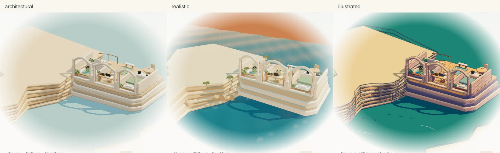
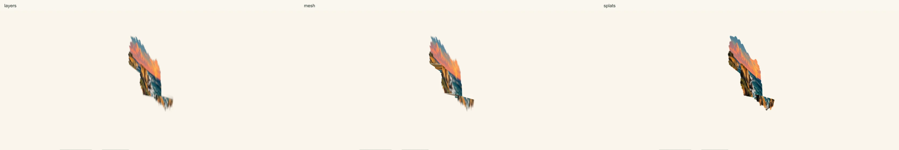

# Research studio review evidence

September 12, 2026, Pacific time. Branch `codex/research-studio-reset`, baseline `bba74ccc1`. Images are browser captures, not concept mockups. Comparison images place the baseline on the left and the revised site on the right; source captures retain their viewport dimensions.

[Implementation and commands](../../research-studio-implementation.md) · [Blender sources and provenance](../../../artwork/coastal-home/PROVENANCE.md) · [Live local preview](http://localhost:8080/?cinematic=live)

## Homepage and reading surfaces

- Homepage: [1440 × 1000](home-1440.webp), [1280 × 800](home-1280.webp), [768 × 1024](home-768.webp), [390 × 1000](home-390.webp), [full page](home-full.webp).
- [Projects index](projects-index-1440.webp) and [DesignWeaver case study](project-designweaver-1440.webp).
- [Blog index](blog-index-1440.webp) and [article with contents rail](blog-research-skills-1440.webp).
- [Publications and compact rejection wall](publications-1440.webp), [mobile CV](cv-390.webp).

The broader checkpoint covers 27 representative public routes at all four sizes, in light and dark. A later 16-check pass recaptured the final blog, publications, homepage, and desk-origin story refinements. Original research diagrams and source credit remain intact.

## Inhabited home

- Same world, three treatments: [study](styles-work.webp), [ocean-facing onsen](styles-soak.webp), [outside](styles-outside.webp).
- [Connected home overview](connected-home.webp), [five avatars](five-avatars.webp), [ten routine activities](daily-rhythm.webp).
- Lizard at [1440](lizard-1440.webp), [1280](lizard-1280.webp), [768](lizard-768.webp), and [390](lizard-390.webp).
- [Live tour](live-tour.webm): real cinematic scrolling, animated activities, camera transitions, and style changes. The tour was recorded with motion enabled; the comparison poses use reduced motion for repeatability.

The final scene matrix passed 29 checks, with three intentional skips for the mobile-only pinch case. The final avatar/pose pass added eight checks across the four viewports, including visible prop geometry and hand contact bounds. A separate live boundary check verifies walking between rooms before settling into the onsen. Album and paper raycasts, keyboard discovery, mobile touch, Human/AI copy/navigation, and the mobile menu passed in Chromium desktop and WebKit mobile (14 checks; two viewport-specific skips).

The original hidden-tab case was strengthened to dispatch both Page Visibility states and a persisted pagehide/pageshow pair. That exposed a real cleanup bug in the old homepage adapter; the adapter now preserves controllers for cached navigation. This is controlled lifecycle-event evidence, not a claim to have tested every browser's memory-eviction behavior.

## Measured cost

Serial Chromium 145.0.7632.6 on this Windows computer, explicitly using the RTX 3080 Ti through ANGLE/D3D11. No CPU/network throttle. Three-second warmup followed by four seconds of live animation. Mobile uses touch, a 390 × 1000 viewport, and DPR 2 emulation; the scene buffer is capped at 1.5. It is not a physical-phone result.

| View                        | 3D ready after choosing it | Architectural | Realistic | Illustrated |
| --------------------------- | -------------------------- | ------------- | --------- | ----------- |
| Desktop 1440 × 1000         | 833 ms                     | 59.9 fps      | 60.0 fps  | 60.1 fps    |
| Mobile emulation 390 × 1000 | 394 ms                     | 60.1 fps      | 59.9 fps  | 59.9 fps    |

The initial 2D page requested no scene modules, Three.js, or GLBs. The conservative largest-room/largest-avatar scene budget is **1,069,895 bytes gzip (1.02 MiB)**, below the 4 MiB target. This is an offline compression estimate, not a claim that local Jekyll compresses those responses. The measured initial engine/data/model HTTP transfer was 3,663,199 bytes. P95 animation-frame intervals were 16.7–16.8 ms; the raw report includes draw calls, triangles, buffer sizes, resource counts, and errors. These measurements reached the display cadence and do not establish spare GPU capacity.

[Raw scene report](scene-performance.json) · [Measurement script](../../../bin/measure_coastal_home.cjs)

An initial uncontrolled headless run was interrupted by Jekyll live reload and was discarded. The reproducible measurement disables only the development live-reload script, explicitly requests D3D11 on Windows, records the actual renderer, and leaves production/visual assets intact.

## Separate splat study

[Frontal comparison](splat-original.webp) · [Oblique comparison](splat-oblique.webp) · [Raw measurements](splat-performance.json) · [Findings and reproduction](../../../artwork/coastal-home/splat-lab/FINDINGS.md)

All three approaches reached 60 fps locally. Their failures differ visually: separated planes, stretched connecting geometry, and a shallow splatted cutout. None supplies the occluded coast needed for a freely explorable home. The generated image and newer Three/Spark dependencies are excluded from the homepage.

## Check boundaries

- 160 Python checks cover the repository contracts and actual exported GLBs; six deterministic Node tests cover the Pacific schedule, DST, weekends, midnight/noon, and Now/Explore state.
- Production Jekyll build with `/al-folio`, changed-file formatting, style contract, skill validation, and diff whitespace checks are included in the handoff verification.
- The repository-wide Prettier command still reports **316 untouched baseline files**. None of those warnings is in a changed or new file in this branch.
- The override audit acknowledges the four edited plugin-shadowing files. **76 untouched legacy entries** still report changes; a Windows line-ending/hash mismatch was confirmed in the baseline. They were not broadly re-acknowledged.
- Full test logs and PNG originals remain in `.jekyll-cache/visual-qa/` locally. The committed subset and live tour are portable; they are excluded from the built website by the existing `docs/` exclusion.

Likeness and expressive quality remain visual judgments for Sirui. The models use authored animation and room paths, not a physics simulation or a general collision solver.
