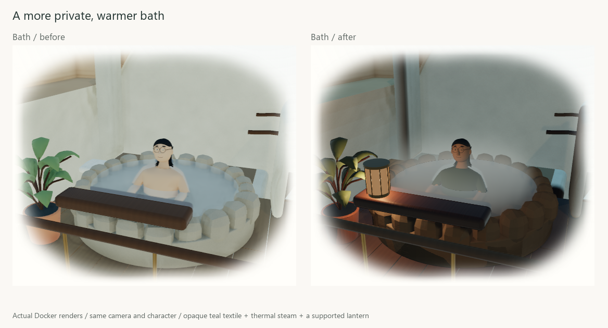
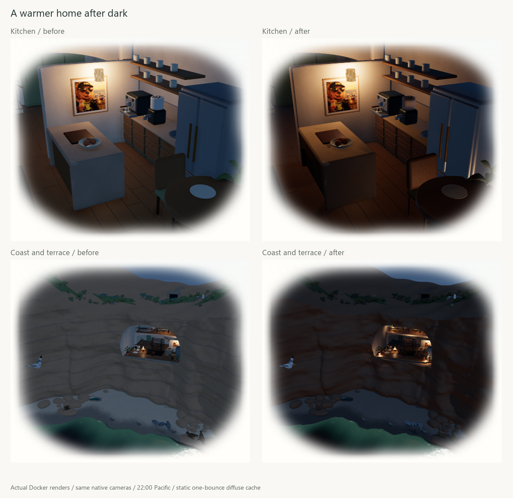

# Warm house: actual render review

This checkpoint addresses the skin-colored bath garment, sparse point vapor, weak architectural lamp placement and uniformly lit interiors. The implementation is saved locally on `main`; publishing is outside this review.

[Play the actual moving bath render](warm-house-motion.webm). The decoded native clip is 7.78 seconds at 544×460, about 197 KB. It contains the shipped teal garment, thermal steam, arm skim, water wake and visiting P. Canvas capture omits the CSS edge vignette. No scene geometry or animation amplitudes were changed for the clip.

## Captures and provenance

The image boards use actual Docker/WebGL output, with the same camera and Ghibli character. Activity captures start from a controlled October 2, 13:20 Pacific date and use the site's existing preview arrivals; soak resolves to 18:35. The night board uses 22:00 and an unoccupied kitchen/exterior. All materials, native assets, PBR/PMREM, contact finish and refraction remain enabled.

Accepted local artifacts are under `.jekyll-cache/visual-qa/warm-house-review/`:

- `before-1440/` and `before-house-1440/`: comparable original scene and fourteen day/night views.
- `accepted-1440/`, `accepted-1280/`, `accepted-768/`, `accepted-390/`: final native study, occupied bath, gym and exterior, including the visible stage/control composition.
- `accepted-house-1440/`: all six rooms and exterior, both 13:15 and 22:00. All fourteen states reported zero runtime errors.
- `final-native-acceptance/`: native GPU steam reference plus actual scene garment, conserved water, temperature/density, upload freeze, pause, offscreen and reduced-motion checks.
- `saved-light-field-native-gpu/`: independent linear GPU diffuse, ambient replacement, zero-ray relighting and replacement-field ownership proof.
- `camera-public-acceptance/`: light/dark nonblank native canvas, real drag/zoom changed pixels, quiet public controls and compiled avatar replacement disposal.
- `source-fresh.json`: actual HTTP source equality after LF normalization. Frozen source hashes and per-state evidence are also saved in [render-evidence.json](render-evidence.json).

Rejected/intermediate fixture and dense-steam trials remain ignored for diagnosis; they are not accepted final screenshots. The night board precedes only the unchanged-output cache ownership/draw-range guards and the unrelated garment tint, so its native lighting arithmetic matches the final field. No generated concept is presented as a renderer result.

## Measured transport

The final native house bake retained 417,123 actual opaque triangles in 98 meshes, traced 37,956 rays, accepted 55 of 56 probes and relocated four. It took 3.78 s over yielded tasks, with a measured maximum task of 21 ms on this run. All eight lamp bounce bases were nonzero. The approximately 35 MB triangle accelerator is released after baking; retained transport/texture backing arrays total 120,960 bytes, including 61,824 bytes of GPU texture backing. Changing sky/lamp inputs traces zero more rays.

Steam uses 18³ cells, fixed 30 Hz scalar transport and a 90×72 RGBA8 atlas (25,920 bytes). The scalar field and scratch consume 241,584 bytes. Its optical extinction is 0.7; the opaque garment remains teal at opacity1 and roughness .96 with shirt diffusion disabled. Native depth captures include the posed actor and displaced pool. The pool still uses its measured .127487 m basin depth and IOR1.333. Only the coffee hopper's actual glass material receives the new IOR1.5 pane response; the misleadingly named laptop screen remains opaque.

The GPU fixtures read actual linear unsigned-byte pixels. Homogeneous vapor agrees with analytic Beer–Lambert transport within .012/channel; an opaque front surface returns the clear reference within .008/channel. Nearest glass stays within .035/channel of the unsplit reference, allowing stock Fresnel/refraction. The diffuse field fixture agrees with rho E / pi within 2/255, is unchanged when legacy hemisphere power rises from2 to9, and returns black inside a closed box. This establishes bounded fixtures, not general transparent-path correctness.

## Acceptance and limits

44 focused CPU tests and166 Python repository tests pass. Style contract and targeted formatting pass. The production `/al-folio` build passes. The repository-wide formatter still reports unrelated existing drift; it is not claimed clean. The final browser gate passes15 checks:2 native transport checks,1 independent field fixture,7 public/camera/disposal checks,1 WebKit mobile check and4 responsive homepage tests (both themes per width). One desktop-only disposal case is intentionally skipped in Chromium mobile.

Primary papers, equations, integration and omitted transport are in [the implementation checkpoint](../../warm-house-checkpoint.md). This is static one-bounce diffuse ray tracing plus approximate single-scatter volumetrics and engine refraction, not a full all-material path tracer. No pressure-projected gas, multiple scattering, dynamic traced shadows, refracted caustics or film-studio realism is claimed. No physical-phone performance measurement was made.

The final native Date-only desktop observation used fresh study/bath pages,120 warm frames and180 measured RAF intervals each. Median RAF was16.7 ms, p95 16.8 ms. Median finish GPU time was6.33/7.75 ms; p95 14.19/18.37 ms. The live Docker watcher remained active and the run overlapped the production build, so this is development-host evidence rather than an isolated benchmark or optimization speedup. Occasional bath GPU samples exceed a16.7 ms budget. The timer omits CPU scalar work and the separate ocean reflection. Full observations are saved in [performance.json](performance.json).
